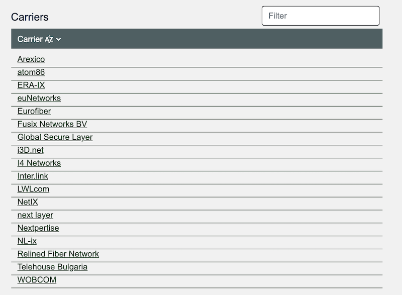
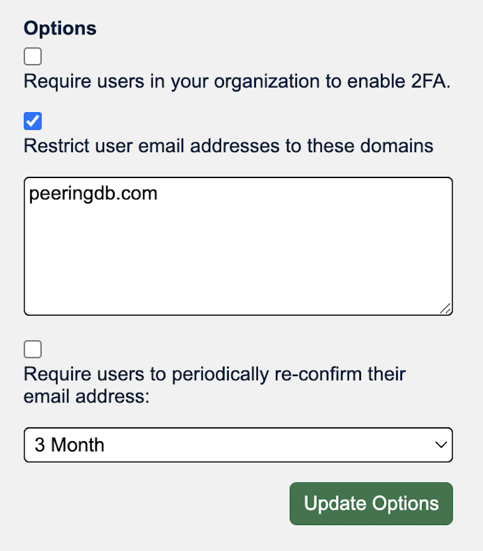

# 2023 Product Report
PeeringDB users have consistently ranked data quality and search as most important. We worked on improvements to these core aspects of our service alongside others in 2023.

We didn’t run a survey at the end of 2023 as we heard the same message consistently. We are in the process of delivering improvements and will survey users again when we have completed their delivery.

We deployed [12 releases](/release_notes/release_notes_2023/) in 2023, addressing 76 issues, 11 of which were bugs. We also introduced four new features and made some significant improvements that all users will care about.

## New data
We introduced two new objects in 2023. 

The [Carrier object](/blog/carrier_object_deployed/) describes networks providing high capacity links between facilities. Now, when you look at a facility you can scroll down and see which carriers have a presence there.

We also introduced the Campus object. This is a set object. It describes a group of facilities where inter-buildings cross-connects are available. When you look at a campus's page on our website you'll see which facilities:

* Are served by each Carrier
* Where each Ix is present
* Where each Network is present

.png)

## Data access
We also started publishing all our facility data in a .KMZ file, which we update once a day. You can either download it regularly or set it as a network location in Google Earth Pro.

You can view facilities in a map view and overlay them with other datasets.

We also introduced a [new search](/blog/search_gets_better/) backend. You can now search for a type of data in a location. It knows the coordinates of facilities and has a radius for each locality. This means you don't need to worry about city names in conurbations – or rural areas. 

## Data quality
We introduced a way for your internal source of truth to [propose updates to PeeringDB](/blog/updates_from_an_internal_source_of_truth/). You don't need to give your internal source of truth any PeeringDB credentials. You can then log into our website and approve or deny the changes.

This helps organizations that are too big for fully manual updates but not big enough to want to automate everything. 

## Improvements
We introduced some policy options for organization admins in 2023. PeeringDB Oauth is increasingly relied on for peering and more. Now, organization admins can require their users to:

* Enable 2FA
* Use an email address tied to a specific domain
* Reconfirm their address periodically

We also introduced a [peering permission](/blog/new_permission_manage_peering_sessions/). Now admins can control who is able to use PeeringDB Oauth for peering portals.

## Volunteer developers
We're glad that volunteers can contribute to PeeringDB. We improved the development environment a couple of years ago and volunteers use it. We'd like to acknowledge 2023 contributions from:

* Carlos Aguado
* Daniel Van Allen
* Todd Crane
* kiraum

## What's coming in 2024?
PeeringDB users have told us that they love the simplicity of our web UI. They've also told us that it's outdated and slow. We have developed new designs for our front end and admin interfaces. We'll start rolling these out in parallel soon. You'll be able to test and provide feedback through preview.peeringdb.com.

We started that process early in 2024. It didn’t go quite right, so we [rolled back the changes](/blog/what_happened_to_our_web_ui/) and will improve our testing and deployment processes.

We'll also be making significant improvements to our .KMZ support. We'll streamline the daily export and make .KMZ available as an export format for Advanced Searches, where that makes sense.

We'll also continue to improve support for the carrier and campus objects.

## People
The [Admin Committee](/committee/admin/), the people behind support@peeringdb.com, changed in 2023. Chriztoffer Hansen took the chair, Peter Helmenstine the vice-chair, and new members joined:

* Budiwijaya
* Ron Grant
* Adam Korab
* Crisóstomo Mbundu
* Ryan Williams

Ben Ryall recruited new members for the [Outreach Committee](/committee/outreach/) in 2023:

* Lynsey Buckingham
* Tarryn Kidd
* Jonathan Martone
* Ester Paal

The [Product Committee](/committee/product/) changed for the start of 2024. We have three new members:

* Jeff Bartig
* Jack Carrozzo
* Paul Hoogsteder

And Stephen McManus will step down as chair of the committee at the start of March.

If you have an idea to improve PeeringDB you can share it on our [low traffic mailing lists](https://docs.peeringdb.com/#mailing-lists) or create an issue directly on [GitHub](https://github.com/peeringdb/peeringdb/issues/). If you find a data quality issue, please let us know at [support@peeringdb.com](mailto:support@peeringdb.com).

--- 

PeeringDB is a freely available, user-maintained, database of networks, and the go-to location for interconnection data. The database facilitates the global interconnection of networks at Internet Exchange Points (IXPs), data centers, and other interconnection facilities, and is the first stop in making interconnection decisions.
