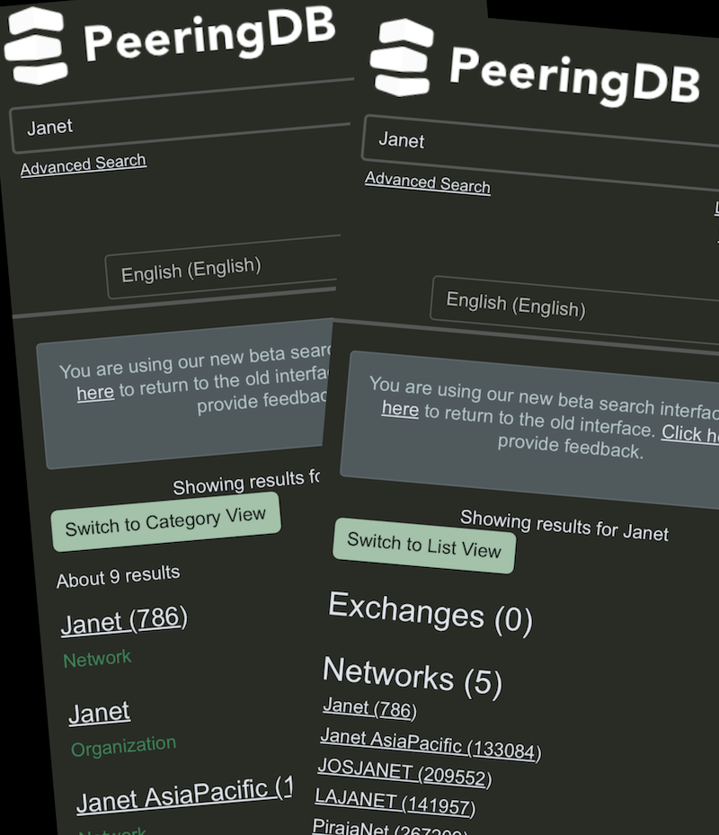

# 2025 Starts With Better Search

We’ve made some improvements to search. Both the results returned and the way they are presented are better. Now, you can have results presented in a simple list or in categories, as before.

You might want to check the searches that are most important to you. We’ve improved in several ways:

* Better results for exact match searches like AS Numbers
* Better results for exact match searches like Campus or Facility names
* Results are more complete while remaining relevant

There are also improvements to bugs in Advanced Search. We've fixed bugs that affected searches for facilities with diverse serving substations, and exporting carrier data.

The reports that alerted us to these bugs will also help us with future improvements. We’re using the feedback provided by users to make major updates behind the scenes. 

If you have an idea to improve PeeringDB you can share it on our [low traffic mailing lists](https://docs.peeringdb.com/#mailing-lists) or create an issue directly on [GitHub](https://github.com/peeringdb/peeringdb/issues). If you find a data quality issue, please let us know at [support@peeringdb.com](mailto:support@peeringdb.com).

--- 

PeeringDB is a freely available, user-maintained, database of networks, and the go-to location for interconnection data. The database facilitates the global interconnection of networks at Internet Exchange Points (IXPs), data centers, and other interconnection facilities, and is the first stop in making interconnection decisions.