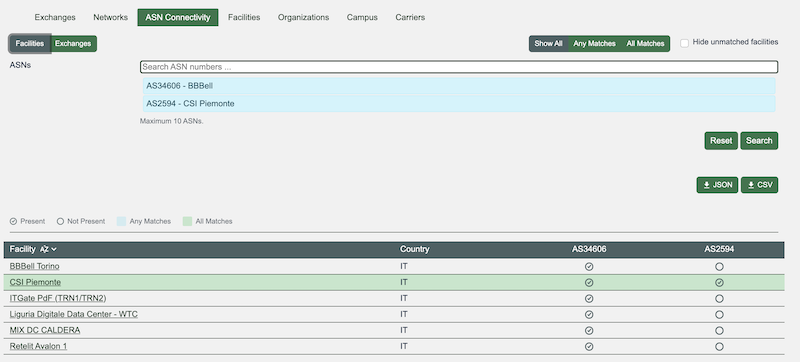

# What we Learned From our 2025 User Survey 

We ran a user survey again in 2025. We saw declining participation surveys between 2020 and 2022, so we paused while we made some changes. 

We had just over 100 responses in this survey and over 120 comments. This is helpful in understanding what is most important to our users – and why.

Satisfaction remains very high, with over two-thirds of respondents satisfied or very satisfied with PeeringDB. While this is a drop since 2022, the survey was open while we experienced degraded service. 

That was the result of AI bots scraping the site. We have now implemented backend changes to address that and will continue to make further improvements.

The degraded service was very important as the people who responded were overwhelmingly regular users. Two-thirds use PeeringDB every day or week, while another quarter use PeeringDB once or twice a month. And those users are more likely to use the website than the API or a local cache, like `peeringdb-py`.

And most of the users who responded have very few PeeringDB users in their organization: more than half have up to three and another third up to nine. This aligns with the preference for the web interface and lack of API and tools usage. 

## Key findings

 * Almost two-thirds of respondents think that PeeringDB’s data quality has improved over the last two years. About one-in-six thinks it’s much better. 
 * Just under 10% of respondents have tried the new copy button to see example API queries. This aligns with the preference for using the website. API users commented that they wanted higher rate limits.
 * Just over a fifth of respondents have tried the new ASN comparison feature but some commented that they couldn’t find it.

 
 * Almost a fifth of respondents have downloaded [facility data as a .KMZ file](https://www.peeringdb.com/export/kmz/). A comment reported a failure getting the .KMZ into https://earth.google.com and [we investigated the report](https://github.com/peeringdb/peeringdb/issues/1860). 

## Focusing future efforts

We asked about how we should focus our future efforts. The responses were highly divided with very little agreement on what needs improvement or what is a priority.

Almost a third of respondents thought that network configuration data quality was the area that needs most focus, with just over a fifth wanting most focus on user experience and web interface. 

There were comments that we couldn’t actually do anything about data quality. There were also comments requesting rules to stop users putting non-Latin characters in their names, such as “☀✪⌁MyFirstIX⌁✪☀”, and to remove “fake ixps”.

Just over a third of respondents were happiest with search and discovery, with about a fifth of respondents happiest with user experience and web interface.

There was least satisfaction with system security, scalability and performance. Almost a quarter of respondents selected this category. This is likely to be related to the site performance problems caused by AI scrapers. 

Dissatisfaction was fairly evenly spread across the other categories.

## Next steps

Decisions about how to improve PeeringDB are made by volunteer committees. They will analyze the survey responses and comments to work out the best path towards improved satisfaction. We’ll then focus on the improvements that will make our users’ lives easier.

If you have an idea to improve PeeringDB you can share it on our low traffic [mailing lists](https://docs.peeringdb.com/#mailing-lists) or create an issue directly on [GitHub](https://github.com/peeringdb/peeringdb/issues). If you find a data quality issue, please let us know at [support@peeringdb.com](mailto:support@peeringdb.com).

--- 

PeeringDB is a freely available, user-maintained, database of networks, and the go-to location for interconnection data. The database facilitates the global interconnection of networks at Internet Exchange Points (IXPs), data centers, and other interconnection facilities, and is the first stop in making interconnection decisions.
