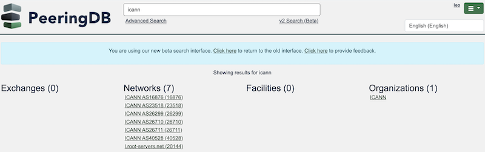

# Alphabetical Search Results

PeeringDB users have told us that data quality and search are what they value most. We have made changes to improve the search experience:

- You can search a radius from any address in [Advanced Search](https://www.peeringdb.com/advanced_search).
- You can filter searches using the criteria important to you.
- You can test our new, faster, [v2 Search](https://www.peeringdb.com/search/v2?q=).

We have just improved v2 search to give back results in alphabetical order. It's a small change but has a big impact.

If there's an exact match for a search term, it will be shown at the very top of the results. Partial matches are shown in alphabetical order.

Try it out! And try out other searches using [v2 Search](https://docs.peeringdb.com/blog/search_gets_better/) and then let us know what you think. We need your feedback to improve search.

If you have an idea to improve PeeringDB you can share it on our [low traffic mailing lists](https://docs.peeringdb.com/#mailing-lists) or create an issue directly [on GitHub](https://github.com/peeringdb/peeringdb/issues). If you find a data quality issue, please let us know at [support@peeringdb.com](mailto:support@peeringdb.com).

---

PeeringDB is a freely available, user-maintained, database of networks, and the go-to location for interconnection data. The database facilitates the global interconnection of networks at Internet Exchange Points (IXPs), data centers, and other interconnection facilities, and is the first stop in making interconnection decisions.
