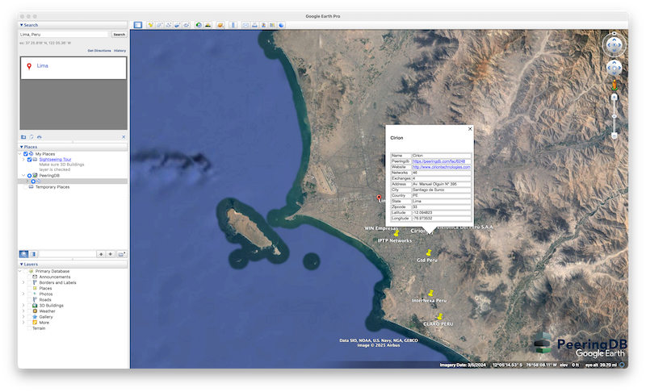
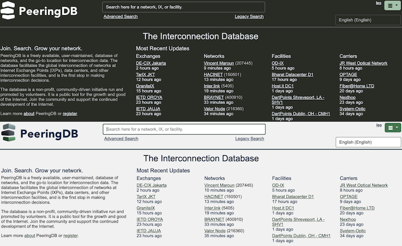
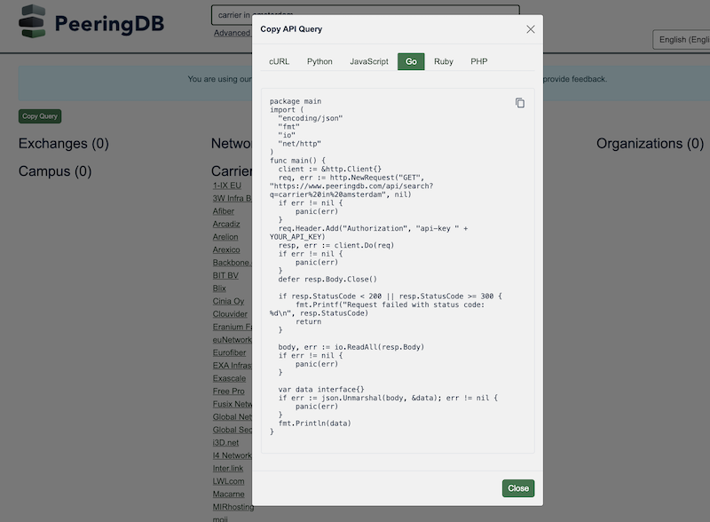

# April 2025 PeeringDB Product Update
## Strategy

This is our second half yearly update. We publish [notes with every release](https://docs.peeringdb.com/release_notes/) and promote new features and bug fixes on social media, these reports are an opportunity to step back and look at the broad sweep of change.

PeeringDB’s board has approved more spending on development and operations work. We now have about 50 percent more resources available. All our committees have access to these development and operations resources. 

One reason for this change was to introduce and expand new features. For instance, while our [daily .KMZ download](https://www.peeringdb.com/export/kmz/) of interconnection facilities was a rapid hit with many users, refining it took too long.

And if you didn’t know already, we publish facility data as a .KMZ file, which we update every day. Now, you can search our data on a map.

## People and process

Product Committee membership has stabilized and we are working more efficiently. We have much more asynchronous discussion, leading to faster decision times on change proposals.

We still encourage users to submit feature requests and bug reports [in GitHub](https://github.com/peeringdb/peeringdb/issues). We want to understand how feature developments can help our users. Please tell us whether you'd use a feature and how it would help. You can do this in GitHub, on [our mailing list](mailto:productcom@lists.peeringdb.com), or when you meet us at industry events.

## Last six months
### `peeringdb-py`

We have been making [`peeringdb-py`](https://docs.peeringdb.com/howto/peeringdb-py/) more robust, reliable, and easier to install. You can now install it with a single command.

`peeringdb-py` is our reference implementation for a PeeringDB cache. We encourage users who want to integrate PeeringDB data into their infrastructure to use `peeringdb-py` or a similar cache. It’s a good way of keeping queries local and so minimizing latency. And it makes any services that rely on our data more robust.

You can now query `peeringdb-py` with [our API](https://www.peeringdb.com/apidocs/). It will sync data automatically, so you’ll always have the latest data available.

### Come over to the dark side

We implemented dark mode for PeeringDB. If you like dark mode, you can choose to run it 24/7 or just after dark. Look in your profile and choose the settings you like best.

### MFA Mandate

The Product Committee has decided to require all users to use a second factor when authenticating. The mandate will be enforced from 1 July 2025.

Our first step towards this was enabling Passkeys support. You can now login to the website using:

* TOTP
* U2F Hardware Security Tokens
* Passkeys

We have new, integrated web pages for managing these methods with a single set of controls. If you need to login to update PeeringDB or look at contact data, please enable at least one second factor.

This change also means changes for authenticated API usage. You won’t be able to use basic authentication from 1 July 2025. You’ll need to use [an API Key](https://docs.peeringdb.com/howto/api_keys/).

This doesn’t mean that anonymous access is going away. You can continue to make anonymous queries on the website and with the API. The only differences are that anonymous users can’t see contact data and have a [lower query limit](https://docs.peeringdb.com/howto/work_within_peeringdbs_query_limits/).

### Search

Search will always be a top priority.

We have made significant improvements to v2 search based on user feedback. We’ll be continuing work to improve search throughout 2025.

You can now hide exchanges that don’t have a presence in an interconnection facility (an `ixfac`) from search results. If you select this feature in your profile, you won’t see them when searching for IXPs. You can also select it from the [Advanced Search](https://www.peeringdb.com/advanced_search) page.

And now you can grab the API query for a search query into your copy buffer. If you like a search and want to get that data regularly, you can quickly find the right one liner to improve your productivity.

It’s not just available for `curl`. You can get little snippets for several popular languages.

The other side of improving search is improving data quality. We are now continuously enforcing place name normalization. That means fewer problems with alternative spellings requiring alternative searches. 

### User management API

We’ve expanded our tools for managing users. We already had:

* User permissions
* Require users to have an email using a specific domain
* Require users to revalidate periodically

We now have an API for managing user accounts. [This API](https://docs.peeringdb.com/howto/user_management_api/) won’t create accounts for users but it will let you automate user management. That means you automate user management.

You can:

* Get a list of all users affiliated with your organization
* Change the permissions for users
* Add an existing PeeringDB user to your organization
* Remove a user from your organization

## Security

We now only support TLS 1.2 and 1.3. Gaurang Maheta suggested this change. We have a [responsible disclosure policy](https://docs.peeringdb.com/howto/make-a-security-report/) and welcome security reports.

## Coming Up
### Website

We’ve started rolling out our new webUI. Our new process has webUI changes go to PeeringDB volunteers first. Then, one in five users will be opted in to the changes. They are notified that they are seeing a new design and have the option to opt out. We will use the acceptance rate along with user feedback to guide the pace of change.

### Comparison

We are developing a comparison feature. Users will be able to do some initial analysis of different interconnection facilities or exchanges. They can then export the data for offline analysis.

### Enable MFA for your account

You will have to use a second factor when authenticating from 1 July 2025. If you haven’t set up a second factor yet, please do so before it’s required. If you share credentials for a role account, we encourage you to get each user to register their own account. And if you have any automation using the API, make sure it's using API Keys and not a username and password.

If you have an idea to improve PeeringDB you can share it on our low traffic [mailing lists](https://docs.peeringdb.com/#mailing-lists) or create an issue directly on [GitHub](https://github.com/peeringdb/peeringdb/issues). If you find a data quality issue, please let us know at [support@peeringdb.com](mailto:support@peeringdb.com).

--- 

PeeringDB is a freely available, user-maintained, database of networks, and the go-to location for interconnection data. The database facilitates the global interconnection of networks at Internet Exchange Points (IXPs), data centers, and other interconnection facilities, and is the first stop in making interconnection decisions.