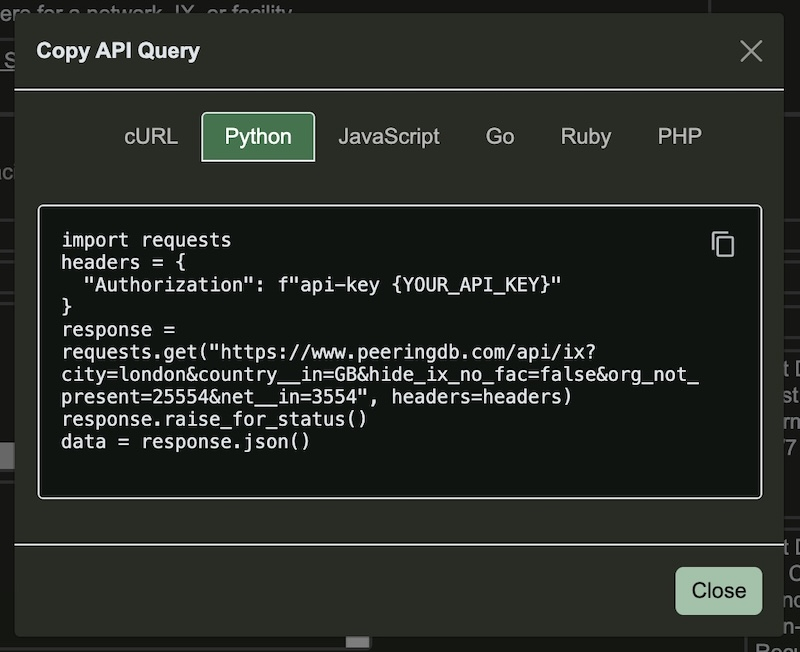
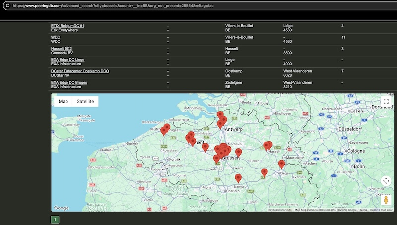
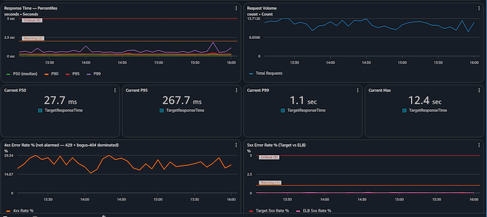
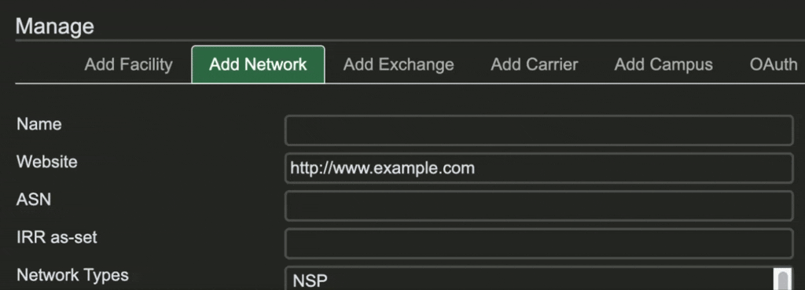

# PeeringDB Update April – September 2026
*21 September, 2026*

## This update

We publish notes with every release and promote new features and bug fixes on social media. These reports are an opportunity to step back and look at the broad sweep of change.

You can find our previous half yearly reports here: [one](october_2024_retrospective.md), [two](april_2025_product_update.md), [three](sep_2025_product_update.md), [four](update_oct_2025-apr_2026.md).

## Feature Updates

As promised in April, we delivered the “Copy API Query” feature for Advanced Search. You can now run a search once on our website and then grab the query to use on the command line, if you’re using `curl`, or formatted for popular scripting languages.

We’ve also introduced an in-page map in the [Advanced Search](https://www.peeringdb.com/advanced_search) pages where it’s relevant. You activate the feature using the slider in your profile. Then you’ll be able to see the distribution of facilities across a city as well as seeing them in a table.

Of course, you can always download a .KMZ formatted [file of all facilities](https://public.peeringdb.com/peeringdb.kmz), which you can view in many GIS applications. The advantage of that option is the ability to show and hide multiple layers of data.

## Operational changes

We tested a change to our deployment process in August by [removing the public beta period](public_beta.md) and going straight to production deployment at the end of internal testing. This followed feedback that the public beta is no longer necessary. We didn’t get any feedback on August’s test, so we’re making the change permanent.

We recognise that major changes will need a public beta period. So when we develop a significant change to the UI or API we will run a public beta.

We’ve also redeveloped our internal operations dashboard. All PeeringDB volunteers will gain access to it in September and we’ll make it public later in the year.

## Data quality

James Bensely suggested some changes to the way we publish AS-SET names and we implemented his ideas.

 * Over September we’re updating set names to show which IRR an AS-SET is in. e.g. `AS-RIPENCC` will be shown as `RIPE::AS-RIPENCC`.
 * When we aren’t sure which IRR should be listed we’re contacting the network and asking them to update it.
 * We’ve introduced a new editor to help you show the set name unambiguously.

We have a couple of minor refinements associated with these improvements coming in then next month or two. For instance, we’ll let you know if the AS-SET name is already used elsewhere in PeeringDB.

## Looking forward

We’re introducing some new metadata values. From next month you’ll be able to signal the date on which you’re joining or leaving an exchange, your MTU, and more.

We’ve published a discussion document for [a new PeeringDB API](https://docs.peeringdb.com/api_v3/). The two key drivers are: 

 * To let us separate the read and write parts of our architecture, which will let us place PeeringDB instances in many places.
 * To enable some more efficient queries. For instance, “*a network with its exchange presences, an exchange with its members, or a facility with its occupants.*”

If you or a colleague use our API, please read the draft and [subscribe to the API v3 discussion list](https://lists.peeringdb.com/cgi-bin/mailman/listinfo/pdb-apiv3-discuss). We want your input so we can refine the design before implementing it.

We’re also looking at how we can let users know if a network’s published maximum prefix count is smaller than the observed number of prefixes. 

Most of our users are human. But we’ve noticed a lot of automated searches by AI systems. To help these users make efficient use of PeeringDB we’ll set up an MCP server and publish an Agent Skills directory in [peeringdb/peeringdb](https://github.com/peeringdb/peeringdb/). 

But while AI systems are good at automating some things for us, we could also improve some of our own comparison tools. We have [ideas for improvements](https://github.com/peeringdb/peeringdb/issues/1979). Please leave a comment in the issue if you’d like us to enhance our comparison tool to do things like:

 * Given 2 IXes, show the list of common networks
 * Given 2 Facilities, show the list of common networks
 * Given an ASN (A) and a location, the nearest IX that ASN (B) is present

If you have an idea to improve PeeringDB you can share it on our low traffic [mailing lists](https://docs.peeringdb.com/#mailing-lists) or create an issue directly on [GitHub](https://github.com/peeringdb/peeringdb/issues). If you find a data quality issue, please let us know at [support@peeringdb.com](mailto:support@peeringdb.com).

--- 

PeeringDB is a freely available, user-maintained, database of networks, and the go-to location for interconnection data. The database facilitates the global interconnection of networks at Internet Exchange Points (IXPs), data centers, and other interconnection facilities, and is the first stop in making interconnection decisions.
