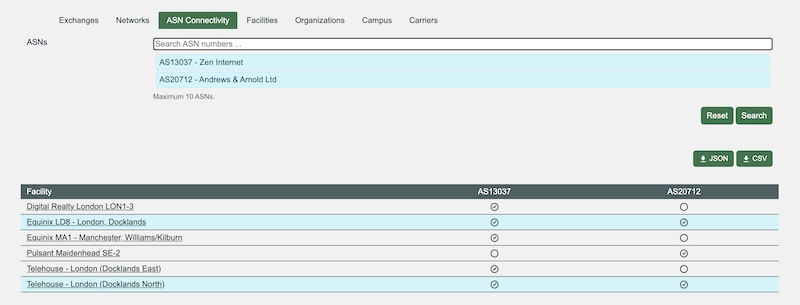

# Comparing Networks on PeeringDB’s Website

We have just launched the initial version of a new feature that will allow users to compare facilities on our website. This feature was suggested by users and gives website users the same capabilities that API users have had since PeeringDB v2 launched in 2016.

Now, users can ask the website to compare networks. As always, results can be exported, so you can further analyze them alongside other sources of data.

Now we have this feature, we need your feedback on how to improve it. What would make it more useful to you? Let us know, so we can improve it for you. We’ve already had some suggestions, which are great. Did they capture your needs? What would make this feature most useful for you?

If you have an idea to improve PeeringDB you can share it on our low traffic [mailing lists](https://docs.peeringdb.com/#mailing-lists) or create an issue directly on [GitHub](https://github.com/peeringdb/peeringdb/issues). If you find a data quality issue, please let us know at [support@peeringdb.com](mailto:support@peeringdb.com).

--- 

PeeringDB is a freely available, user-maintained, database of networks, and the go-to location for interconnection data. The database facilitates the global interconnection of networks at Internet Exchange Points (IXPs), data centers, and other interconnection facilities, and is the first stop in making interconnection decisions.