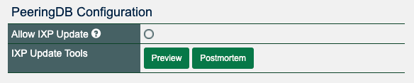
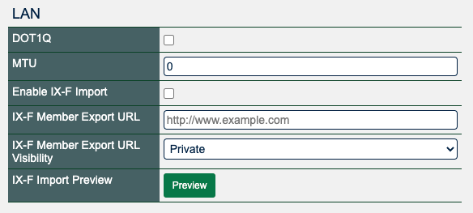

# Automating Configuration - Why We Support the IX-F Member Export Schema
We just released 2.29.0-beta and three of the improvements relate to our support for the [IX-F Member Export Schema](https://github.com/euro-ix/json-schemas). The last year has seen half a dozen releases with changes to better support it. But why should PeeringDB support this API? Why should exchanges use it? And how can networks benefit from it?

It is an agreed standard for which allows IXPs to make their member lists available for automatic consumption by tools like PeeringDB. Exchanges can publish important technical information about their participating networks, including their AS Number and IP address information.

There are [freely available tools](https://docs.peeringdb.com/tools/) that use this data to build configurations and automate work that would otherwise require tickets, and some copy and paste.

So, how can a network take advantage of this if they participate at an exchange using the schema? It’s simple, just select the “Allow IXP Update” radio button in your network configuration page.

And if you’re an exchange that sees the advantage of automatically sharing information about your participating networks? If you are using software that can automatically generate the JSON, you just need to configure the URL for us to poll in the LAN configuration panel for your exchange.

Our continuing efforts in this area are designed to help exchanges share more accurate information about their participants, and networks to automate configuration. So, take a look at what the schema can do for your organization.

If you have an idea to improve PeeringDB you can share it on our [low traffic mailing lists](https://docs.peeringdb.com/#mailing-lists) or create an [issue](https://github.com/peeringdb/peeringdb/issues) directly on GitHub. If you find a data quality issue, please let us know at support@peeringdb.com. 

--- 

PeeringDB is a freely available, user-maintained, database of networks, and the go-to location for interconnection data. The database facilitates the global interconnection of networks at Internet Exchange Points (IXPs), data centers, and other interconnection facilities, and is the first stop in making interconnection decisions.
