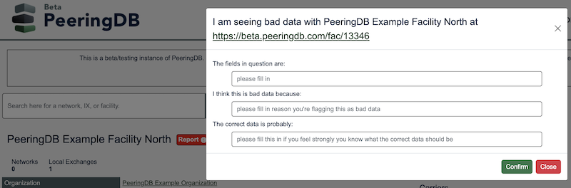
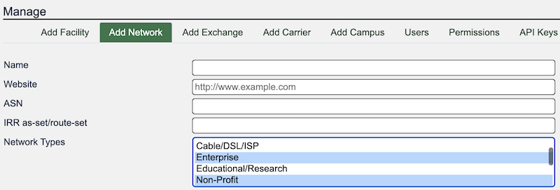
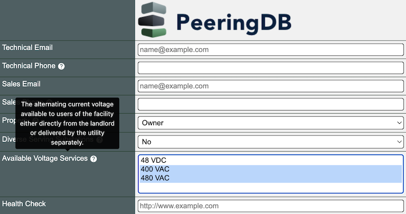

# Better Data

PeeringDB users told us in surveys that data quality and search results are their two top priorities. Release 2.54.0 has multiple changes to improve data quality and search results. 

## Report inaccurate data

One of them is a feature allowing logged in users to report data they believe to be inaccurate. Every page now has a button that lets users report data they believe is inaccurate. The report form lets the user identify the specific element believe to be wrong, along with a reason. If the user knows, they can suggest what the correct data should be.

The Admin Committee will review reports. 

## Network types

Many networks provide more than one kind of function. You can now select more than one type for each network you run. 

The Product Committee considered adding more granularity for network types. They decided against it, as not everyone shares the same understanding of terms. Allowing networks to select multiple options is a compromise that doesn't require a breaking change in the API. The Network Type field will probably not be imported into v3 of the API.

## Power choices

The Available Voltage Services field now only shows non-standard power offers. Everyone expects data centers to offer power at the standard voltages for the country or territory they serve. What users find interesting is the non-standard offers. For the time being we only offer three of these non-standard power options.

If you offer a different non-standard power option, please let us know.

If you have an idea to improve PeeringDB you can share it on our low traffic [mailing lists](https://docs.peeringdb.com/#mailing-lists) or create an issue directly on [GitHub](https://github.com/peeringdb/peeringdb/issues). If you find a data quality issue, please let us know at [support@peeringdb.com](mailto:support@peeringdb.com).

--- 

PeeringDB is a freely available, user-maintained, database of networks, and the go-to location for interconnection data. The database facilitates the global interconnection of networks at Internet Exchange Points (IXPs), data centers, and other interconnection facilities, and is the first stop in making interconnection decisions.
