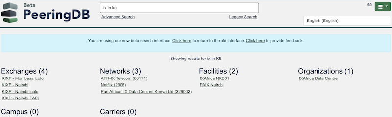
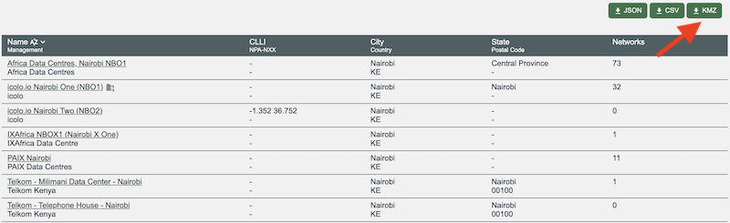

# Better Search and Export

PeeringDB users tell us that they most value search and data quality. We've been working on improved search for the last year and have made another improvement to it. It now recognizes [ISO 3166-1 alpha-2 codes](https://www.iso.org/iso-3166-country-codes.html) – the codes used for ccTLDs.

This means you can now search for things like all the facilities or IXPs in a country.

But sometimes you want to visualize our data. For a while we've been offering [a .KMZ file of all the facilities in PeeringDB](/blog/peeringdb_map_with_kmz/) with a geocode. We've now improved that file. The new format removes unneeded fields, making it small enough for Google Maps to use. 

And you can export any advanced search based on location in a KMZ format.

So take a look at these features on [beta.peeringdb.com](https://beta.peeringdb.com) ahead of their deployment to production.

If you have an idea to improve PeeringDB you can share it on our low traffic [mailing lists](https://docs.peeringdb.com/#mailing-lists) or create an issue directly on [GitHub](https://github.com/peeringdb/peeringdb/issues). If you find a data quality issue, please let us know at [support@peeringdb.com](mailto:support@peeringdb.com).

--- 

PeeringDB is a freely available, user-maintained, database of networks, and the go-to location for interconnection data. The database facilitates the global interconnection of networks at Internet Exchange Points (IXPs), data centers, and other interconnection facilities, and is the first stop in making interconnection decisions.
