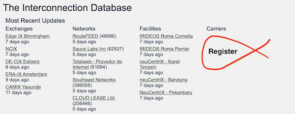

# Carrier Objects

We introduced support for `carrier` objects in release 2.43.0. This is the first new pillar of data we’ve introduced for several years. Take a look and tell us how we can improve our implementation.

A “Carrier” provides high capacity links between facilities. Networks and IXPs use these to connect equipment spread across multiple interconnection facilities in a metro area. They are different from the regular network in PeeringDB because their services run [at layers 1 or 2](https://en.wikipedia.org/wiki/OSI_model#Layer_1:_Physical_layer). 

Our initial deployment lets carriers show that they have a presence in an interconnection facility. It does not show what services are provided, like wavelengths or fiber. 

This is a tighter set of features than was suggested by the [focus group in 2021](https://docs.peeringdb.com/blog/carrier_object/). We want to get a minimal set of features out first and see how they are received before tackling more complicated features. We have started small and will expand based on user demand.

If this is a feature that your organization could benefit from, please take a look and tell us what you think. You can contact us on social media, and you can reach the Product Committee on [our mailing list](mailto:productcom@lists.peeringdb.com).

If you have an idea to improve PeeringDB you can share it on our [low traffic mailing lists](https://docs.peeringdb.com/#mailing-lists) or create an issue directly [on GitHub](https://github.com/peeringdb/peeringdb/issues). If you find a data quality issue, please let us know at [support@peeringdb.com](mailto:support@peeringdb.com).

---

PeeringDB is a freely available, user-maintained, database of networks, and the go-to location for interconnection data. The database facilitates the global interconnection of networks at Internet Exchange Points (IXPs), data centers, and other interconnection facilities, and is the first stop in making interconnection decisions.
