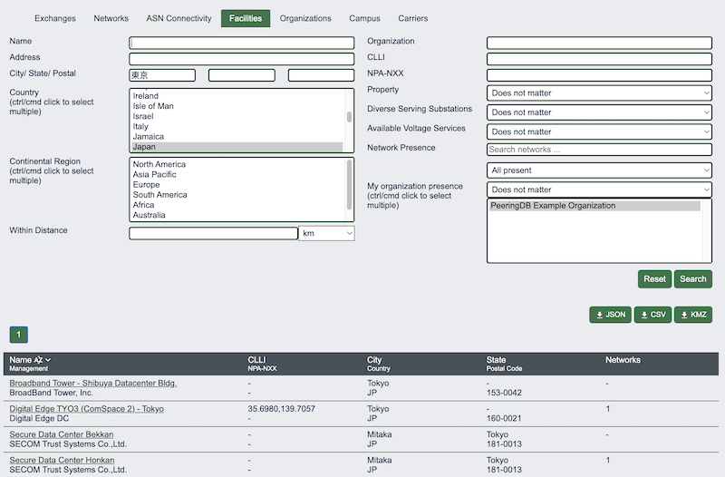
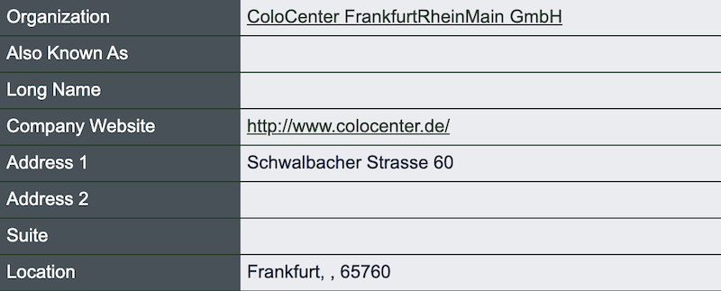
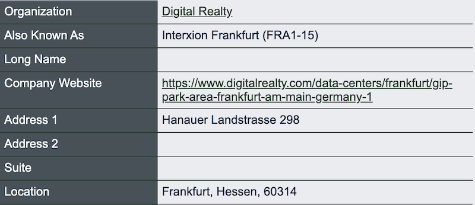

# Data Quality and Location Data Normalization
*March 18, 2026*

We’ve been incrementally improving the quality of PeeringDB’s location data. Nonetheless, one of the comments in our 2025 user survey was: *“the question is moot \- you can't really do anything about the users providing incomplete or stupid data.”*

This comment was anchored in PeeringDB’s user-maintained nature. But searching and analyzing data that uses inconsistent terminology is cumbersome and error prone. So maybe we could retain the fundamental user-maintained nature of PeeringDB while helping users get consistently formatted data out.

We’ve done that by letting people search for whatever variant of a name is useful to them. But data is always returned in English. For instance, searches for Tokyo and 東京 both deliver the same output.

We now normalize the presentation of several parts of addresses:

* Country names  
* State or province names (in Australia, Brazil, Canada, and the US)  
* City names

Along the way we’ve found that we have to use different databases to get accurate naming for locations in different countries. We’ve tested several naming databases and our experience is that using a combination gives us the best results.

The good news is that placenames change slowly, so we only need to look up a name once. This means that normalizing placenames is cost effective.

But we haven’t normalized in every country. We know that internal subdivisions aren’t significant in addresses in some countries. But are there more countries where we need to normalize location data? And are there places where we need to make improvements?

One example is Germany. We’ve not forced the names of internal subdivisions, which leads to some inconsistencies. Do these matter?

 

And are there other aspects of data quality that are important to PeeringDB users? Please let us know.

We’ll be at over 40 events this year. So if you see anyone from the PeeringDB team, please stop for a chat and let us know. Otherwise, we’d love to hear from you on the [User-Discuss mailing list](https://lists.peeringdb.com/cgi-bin/mailman/listinfo/user-discuss), or direct to the [Product Committee’s private list](mailto:productcom@lists.peeringdb.com).

If you have an idea to improve PeeringDB you can share it on our low traffic mailing lists or create an issue directly on GitHub. If you find a data quality issue, please let us know at support@peeringdb.com.

---

PeeringDB is a freely available, user-maintained, database of networks, and the go-to location for interconnection data. The database facilitates the global interconnection of networks at Internet Exchange Points (IXPs), data centers, and other interconnection facilities, and is the first stop in making interconnection decisions.
