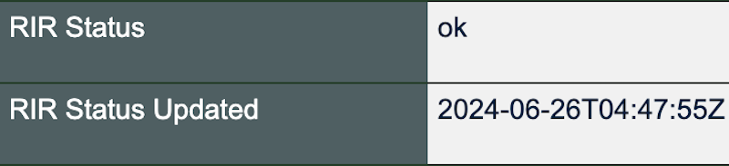

# Data Quality⸺Removing Closed Networks

We added an "RIR Status" field in the data returned for networks a few months ago. The "ok" status lets you know that the ASN was assigned by an RIR or NIR. The "RIR Status Updated" field lets you know when we last checked.

We use these fields to enable automation. In September we’ll remove about 400 networks that have been returned to the RIR. We check the status of the network every day and will only flag it for deletion if the status was “not assigned” for three months. This automation runs every month.

It will improve data quality. You won't see results for networks that aren't operating anymore. And organizations assigned those returned and reissued ASNs will be able to register on PeeringDB without needing support from our volunteer Admin Committee.

If you have an idea to improve PeeringDB you can share it on our low traffic [mailing lists](https://docs.peeringdb.com/#mailing-lists) or create an issue directly on [GitHub](https://github.com/peeringdb/peeringdb/issues). If you find a data quality issue, please let us know at [support@peeringdb.com](mailto:support@peeringdb.com).

--- 

PeeringDB is a freely available, user-maintained, database of networks, and the go-to location for interconnection data. The database facilitates the global interconnection of networks at Internet Exchange Points (IXPs), data centers, and other interconnection facilities, and is the first stop in making interconnection decisions.