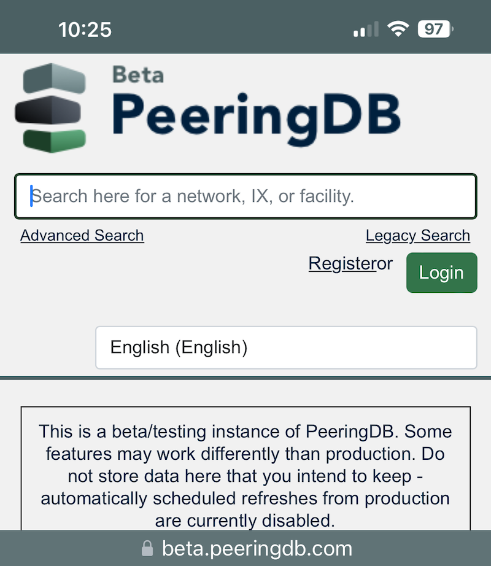

# Making beta.peeringdb.com, Search, and KMZ more Attractive

Just over half a percent of users visit [beta.peeringdb.com](https://beta.peeringdb.com) each month. We recognize that there are good and bad reasons for this. 

On the good side, people are pretty happy with [www.peeringdb.com](https://www.peeringdb.com). But on the bad side, we only used to refresh the data in [beta.peeringdb.com](https://beta.peeringdb.com) once a month.

But we've changed that. As of release 2.57.0, our beta site refreshes once an hour. This means it's an ideal place to test your searches each month – and get early access to new search features. 

Of course, you can also test making updates on our beta site. But any changes you make will be wiped at the next refresh.

We're also refining our .KMZ export in 2.57.0. The export has tidier entries for each `fac`, improves the placemark, and drops facilities without location data.

And two bugs have been fixed for v2 search, which is now the default search. A problem searching for a "`fac` in city name" has been resolved. And a bug that caused a server error when the last character was a colon has also been fixed.

So, head on over to [beta.peeringdb.com](https://beta.peeringdb.com) and test these improvements. Let us know if you see any problems with these improvements.

If you have an idea to improve PeeringDB you can share it on our low traffic [mailing lists](https://docs.peeringdb.com/#mailing-lists) or create an issue directly on [GitHub](https://github.com/peeringdb/peeringdb/issues). If you find a data quality issue, please let us know at [support@peeringdb.com](mailto:support@peeringdb.com).

--- 

PeeringDB is a freely available, user-maintained, database of networks, and the go-to location for interconnection data. The database facilitates the global interconnection of networks at Internet Exchange Points (IXPs), data centers, and other interconnection facilities, and is the first stop in making interconnection decisions.
