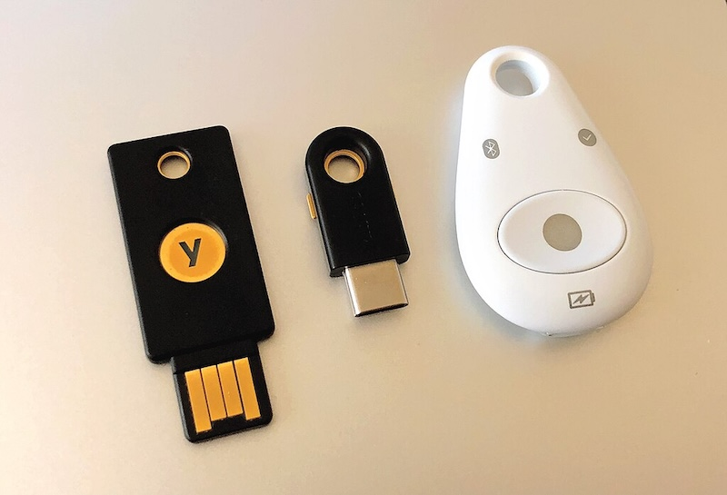
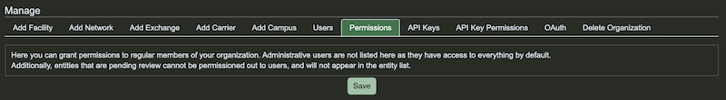
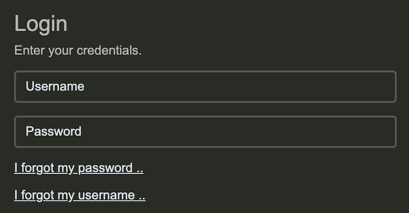

# PeeringDB To Require MFA and API Keys 

You must have a [second factor](/howto/enable_require_2fa/) to log in to PeeringDB starting on 1 July 2025. If you automate updates using [our API](/api_specs/), you'll need to use an [API Key](/howto/api_keys/).

But anonymous usage will not be going away. You can query the website or API without authenticating. This change will impact users who make updates or need access to contact information published in PeeringDB.

To prepare for this we have simplified our user interface. We now have a [single control page](https://www.peeringdb.com/account/two_factor/) for second factors. You can still choose from:

* TOTP
* U2F tokens, and
* Passkeys

Users can have multiple second factors. For instance, TOTP in an app on a phone and a U2F token. And users can download and securely store backup codes in case other factors aren’t available.

Some organizations might need to move users from role accounts to personal accounts. We don't limit the number of accounts affiliated with an organization. And we provide permissions to manage permissions for individual users.

If you automate updates with our API, you'll need to use an API Key. You'll also need an API Key if you want to get access to contact details using the API.

We have self-service account recovery for users who lose a credential. Click the link from the login page and you’ll get a mail with account recovery details.

All users can get support from [support@peeringdb.com](mailto:support@peeringdb.com).

--- 

If you have an idea to improve PeeringDB you can share it on our low traffic [mailing lists](https://docs.peeringdb.com/#mailing-lists) or create an issue directly on [GitHub](https://github.com/peeringdb/peeringdb/issues). If you find a data quality issue, please let us know at [support@peeringdb.com](mailto:support@peeringdb.com).

PeeringDB is a freely available, user-maintained, database of networks, and the go-to location for interconnection data. The database facilitates the global interconnection of networks at Internet Exchange Points (IXPs), data centers, and other interconnection facilities, and is the first stop in making interconnection decisions.
