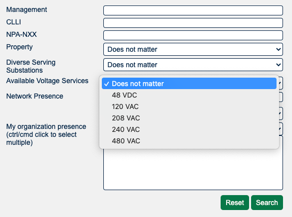

# More Details on Facilities

<mark>Did you know PeeringDB’s 2021 User survey is open until 8 October? It takes about 3 minutes and will set the direction for PeeringDB in 2022. Please [click here](https://surveyhero.com/c/peeringdb2021usersurvey) to tell us where to improve.</mark>

We’ve been working hard on improving search this year. In release 2.30.0 we have an improvement that will help data centers and their users. Organizations running facilities can now share information about ownership status, power availability, diversity and resilience. These can all be used as filters in the [advanced search page](https://www.peeringdb.com/advanced_search). You will need to be logged in to take advantage of these features.

These improvements build on improvements delivered in [2.27.0](/release_notes/#release-2271) and [2.28.0](/release_notes/#release-2280). We have additional search improvements scheduled for development in upcoming releases. If you run a facility you’ll want to login and update its entry, so it can be found when users take advantage of these new searches.

If you have an idea to improve PeeringDB you can share it on our low traffic [mailing lists](https://docs.peeringdb.com/#mailing-lists) or create an issue directly on [GitHub](https://github.com/peeringdb/peeringdb/issues). If you find a data quality issue, please let us know at [support@peeringdb.com](mailto:support@peeringdb.com).

--- 

PeeringDB is a freely available, user-maintained, database of networks, and the go-to location for interconnection data. The database facilitates the global interconnection of networks at Internet Exchange Points (IXPs), data centers, and other interconnection facilities, and is the first stop in making interconnection decisions.
