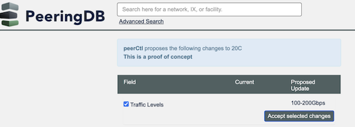

# Do You Want Your Configuration Management System to Update PeeringDB?

The theme for NANOG 87's Hackathon was interacting with sources of truth. Our project focused on identifying the difference between what's in a configuration system and PeeringDB—then sending an update.

Developers from [FullCtl](https://www.fullctl.com/) and [Peering Manager](https://peering-manager.net/) worked together to develop a proof of concept feature. It let users know when PeeringDB did not reflect the internal config. It then made it easy to send PeeringDB an update.

[Users tell us](https://docs.peeringdb.com/blog/peeringdb_2023_roadmap/) that Network Configuration Data is what they value most. So developing ways to help users identify what to update could be valuable. And offering a way to tie that to an update mechanism could make updating PeeringDB  much faster.

We've created [an issue describing this on GitHub](https://github.com/peeringdb/peeringdb/issues/1328). If you or your organization would benefit from a feature like this, please let us know. You can comment on the issue, write to the [Product Committee's list](mailto:productcom@lists.peeringdb.com), or chat with a PC member.

If this is something our users want then we'll need to answer some questions. One example is how to manage multiple updates. How should web users be invited to review multiple updates, so they can approve or reject as needed? 

We also need to think about how to keep parity between the website and the API. The API supports write operations but is not interactive. So it might be important to add in a feature to [show orgs the changes](https://github.com/peeringdb/peeringdb/issues/979) made to their objects. And we might want to add the ability to add a comment alongside updates, so admins can later review logs of what changed and why. 

We want to speak with people who develop tools that might implement this feature. If you develop a tool that could benefit from a feature like this then let us know. We'd like to speak.

If you have an idea to improve PeeringDB you can share it on our low traffic mailing lists or create an [issue directly on GitHub](https://github.com/peeringdb/peeringdb/issues). If you find a data quality issue, please let us know at [support@peeringdb.com](mailto:support@peeringdb.com).

--- 

PeeringDB is a freely available, user-maintained, database of networks, and the go-to location for interconnection data. The database facilitates the global interconnection of networks at Internet Exchange Points (IXPs), data centers, and other interconnection facilities, and is the first stop in making interconnection decisions.
