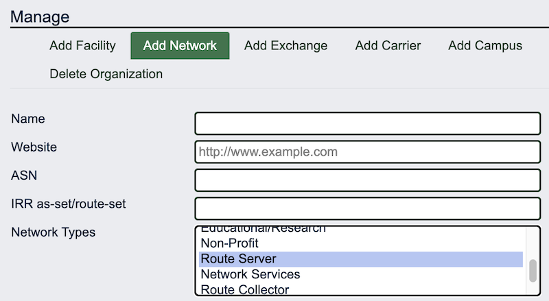

# Network Type: What's it for? How to use it?

When you add a network to PeeringDB you can choose to describe it with one or more human readable types selected from a list.  

  

# The intention?

It’s a way to hint at the value of interconnection with a network. For instance, a network describing itself as “Cable/DSL/ISP” is likely to have many subscribers who want access to streaming content. Similarly, an exchange might want to clearly distinguish its route server networks from any other networks it runs.

The network type was a part of our first API and was imported into the [current API](https://docs.peeringdb.com/api_specs/) when we transitioned. Since then, we’ve added extra types, like [government](https://github.com/peeringdb/peeringdb/issues/381) and [network services](https://github.com/peeringdb/peeringdb/issues/463). But growing the list is only useful if the information is reliable and actually used.

# Used in peering decisions?

The [next time we looked at it](https://github.com/peeringdb/peeringdb/issues/1357) we discussed whether the list helped users get a sense of likely inbound and outbound traffic ratios. We considered adding additional categories or updating them periodically. In the end we decided that some category names are understood differently by different users. Refining the list of types would become a regular task – both for us and the networks that need to update their type – as the world and the interconnection landscape changes.

But when we asked users they told us that they found it useful and considered it reliable enough. So the [immediate decision](https://github.com/peeringdb/peeringdb/issues/1357#issuecomment-1631509284) was to enable multi-select. That's why you can describe your network as both Educational/Research and Enterprise, or Content and Network Services.

# Reliable data?

We haven’t commissioned research into the accuracy of the data. When you use it you should consider two things: it is self declared and rarely updated. It could be that it’s rarely updated because networks don’t add new services that could be added in the multi-selector. And it’s also possible that they just set and forget.

# The future

If we move from v2 to v3 of our API we’ll reconsider whether network type is worth bringing along. But we don’t currently have plans that would require a new API.

If you have an idea to improve PeeringDB you can share it on our low traffic [mailing lists](https://docs.peeringdb.com/#mailing-lists) or create an issue directly on [GitHub](https://github.com/peeringdb/peeringdb/issues). If you find a data quality issue, please let us know at support@peeringdb.com.

---

PeeringDB is a freely available, user-maintained, database of networks, and the go-to location for interconnection data. The database facilitates the global interconnection of networks at Internet Exchange Points (IXPs), data centers, and other interconnection facilities, and is the first stop in making interconnection decisions.