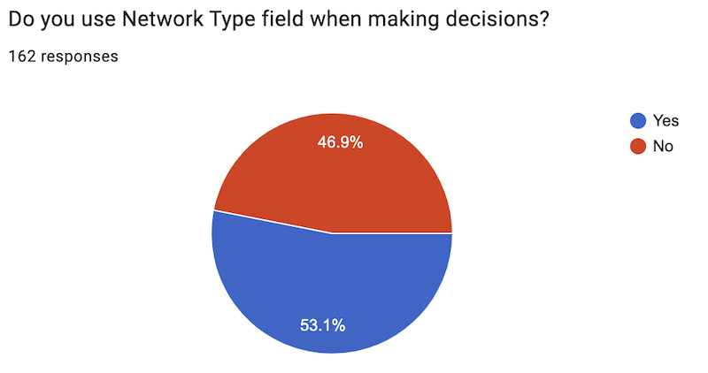
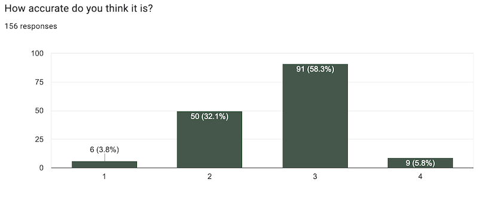
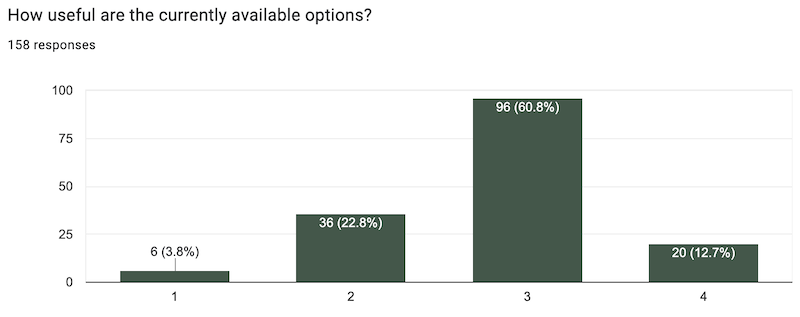
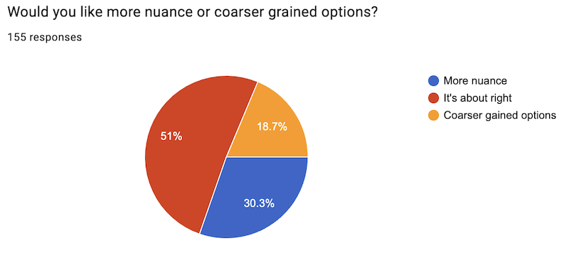

# Network Type – What did you tell us?

[We invited](https://docs.peeringdb.com/blog/network_type_your_input_sought/) PeeringDB users to tell us what they thought about the Network Type setting. This is the setting that describes your network to other PeeringDB users.

## It's OK

162 people participated and their core message was that the field is largely working for both those sharing and reading the data. 

Just over half of respondents use the field to make decisions. 

About two thirds think it is accurate or very accurate.

About three quarters think the current range of options is useful or very useful.

About half think the level of granularity is about right, while almost a third would like more nuance.

## Comments

Lots of people told us how they use the Network Type field in the comments. 

Some reinforced their responses to the other questions with calls to remove the field, add additional options, or restrict the options to “eyeball”, “content”, and “hybrid”.

There was also a call to allow networks to select multiple categories. 

## Next Steps

The [Product Committee](https://docs.peeringdb.com/committee/product/) has decided to keep the Network Type field. We will not change the types of networks but will implement the ability to select multiple types. This will be implemented in the website and v2 API now deployed. We will plan a more radical update of the field for a future v3 API.

If you have an idea to improve PeeringDB you can share it on our [low traffic mailing lists](https://docs.peeringdb.com/#mailing-lists) or create an issue directly [on GitHub](https://github.com/peeringdb/peeringdb/issues). If you find a data quality issue, please let us know at [support@peeringdb.com](mailto:support@peeringdb.com).

---

PeeringDB is a freely available, user-maintained, database of networks, and the go-to location for interconnection data. The database facilitates the global interconnection of networks at Internet Exchange Points (IXPs), data centers, and other interconnection facilities, and is the first stop in making interconnection decisions.