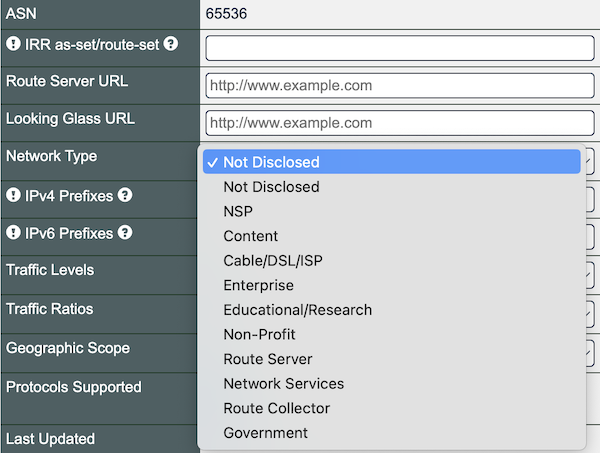

# Network Type – Your Input Sought

You can select from 10 options to describe your network in PeeringDB. We want to know if these options are useful. If we need to improve this part of PeeringDB, [how should we improve it](https://forms.gle/yU53MyDUpvaUkMjR8)?

Please take our [four question survey](https://forms.gle/yU53MyDUpvaUkMjR8). We need your input to inform our decision.

One option we're discussing is to [clarify what each category means](https://github.com/peeringdb/peeringdb/issues/1357). Another is to [deprecate the field](https://github.com/peeringdb/peeringdb/issues/1379).

We know that not everyone understands the current categories in the same way. We don't know if anyone actually relies on this data to make decisions.

Please take the survey and tell us if you use this data, how reliable you think it is, and how it should change if you think it needs improvement.

The improvements we make are only as good as the requests we get from you. We want to make sure that we understand what you need and why. If you have an idea to improve PeeringDB you can share it on our low traffic [mailing lists](/#mailing-lists) or create an issue directly on [GitHub](https://github.com/peeringdb/peeringdb/issues). If you find a data quality issue, please let us know at [support@peeringdb.com](mailto:support@peeringdb.com).

---

PeeringDB is a freely available, user-maintained, database of networks, and the go-to location for interconnection data. The database facilitates the global interconnection of networks at Internet Exchange Points (IXPs), data centers, and other interconnection facilities, and is the first stop in making interconnection decisions.
