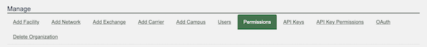

# New Permission: Manage Peering Sessions

Last November, [Maximilian Wilhelm suggested](https://github.com/peeringdb/peeringdb/issues/1290) that we add a 'manage peering sessions' permission. 

Some networks let you request peering using our [OAuth service](https://docs.peeringdb.com/oauth/). You don't have to rely on someone to read your email message. They get the ability to pull structured information about your network through our API. Automation. Everyone can win.

Today, in [2.47.0](https://docs.peeringdb.com/release_notes/), we’re introducing a new permission that lets organizations limit who can "manage peering sessions" via peering portals.

It will default to ‘on’ for organizational admins. But other users won’t get this permission by default. If you need this permission you’ll need to speak with the admins for your organization’s presence on PeeringDB.

>*Today many peering portals leverage PeeringDB's OAuth to make managing peerings easier and remove the need to manage separate accounts with every network you peer with. The new "manage peerings" permission lets organisations control which of their teams can represent them to external organisations instead of relying on admin privileges in PeeringDB, providing safer and more secure access.*
>Maximilian Wilhelm, Network Automation Engineer, Cloudflare

Take a look at these new permissions if you use PeeringDB OAuth to manage peering sessions. If you operate a peering portal using our OAuth, you should make sure you check 
the new permission when authenticating users.

If you have an idea to improve PeeringDB you can share it on our [low traffic mailing lists](https://docs.peeringdb.com/#mailing-lists) or create an issue directly [on GitHub](https://github.com/peeringdb/peeringdb). If you find a data quality issue, please let us know at [support@peeringdb.com](mailto:support@peeringdb.com).

--- 

PeeringDB is a freely available, user-maintained, database of networks, and the go-to location for interconnection data. The database facilitates the global interconnection of networks at Internet Exchange Points (IXPs), data centers, and other interconnection facilities, and is the first stop in making interconnection decisions.

