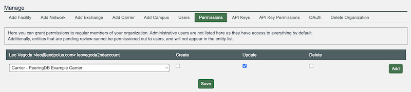
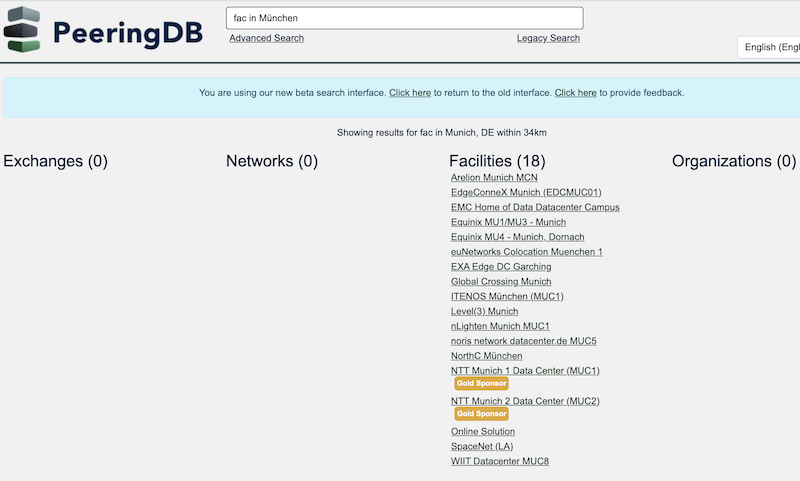
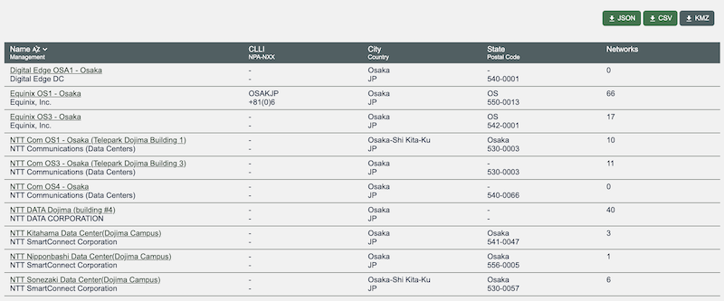
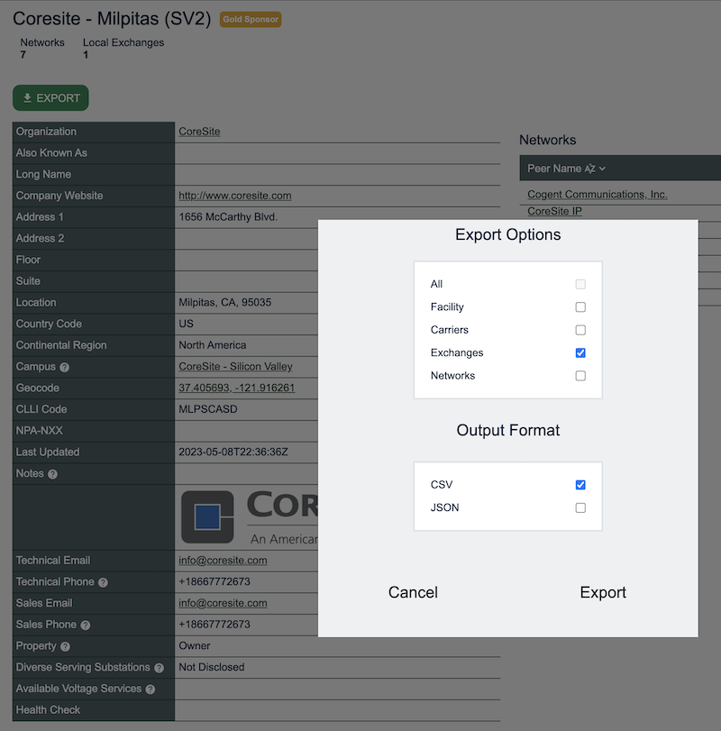
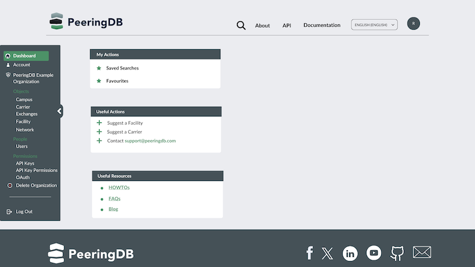

# October 2024 PeeringDB Product Update

## Strategy
We reviewed and updated our strategy earlier in the year. We will be publishing overviews of product changes in April and October. We've had a blog for a few years but it’s focused on details. These updates will give a bigger picture.

## People and process
Terry Sweetser from APNIC has recently joined the Product Committee (PC). The PC now has members from Africa, Asia Pacific, Europe, and North America. Our committee’s geographic diversity is matched by a diversity in expertise.
 
We have updated our processes because our members live around the globe. We are using asynchronous work methods more. And we will focus on planning out sets of related issues to improve PeeringDB more quickly.

We still encourage users to submit feature requests and bug reports in GitHub. We want to understand how feature developments can help our users. Please tell us whether you'd use a feature and how it would help. You can do this in GitHub, on our mailing list, or when you meet us at industry events.

## Last six months
We've been rounding out support for Carrier objects. Organizations can now set user permissions for carriers.

We’ve also been working to improve data quality.

We now enforce state naming. For instance, Queensland in Australia is now always QLD. We also normalize city names in responses but accept popular versions in the search request. So, a search for "fac in München" returns results for facilities within 34 km of Munich, Germany.

The radius search is managed in the backend by the new search. It's different for each city. You can control the radius in Advanced Search, or just look on a map when you download our KMZ.

The full KMZ download was popular. So, we tidied up the data in the export, added a watermark, so users know that they have PeeringDB data, and integrated KMZ support into other features.

You can now download a .KMZ file of exchanges or facilities in a city, state, or country. This keeps the file size small, making it easier to integrate it with other data sources.

Once you’ve found the carrier, exchange, facility, or network you are interested in you can now export all their data in structured formats. Previously, this was only available for Advanced Search results.

These data quality, search and extract features are one part of the work we've been doing. We've also put more effort into peeringdb-py, our local cache. We encourage anyone who wants to make heavy use of PeeringDB to run a local cache. There are no usage limits and no latency. 

If you often hit query limits then it could be worth installing. It is resource light, so it can run on a laptop as well as a server. If you sync it once an hour, the changes are normally under 100kb of data.

We’ve also made improvements behind the scenes. We’ve switched to deploying PeeringDB in containers. This change will reduce the work needed by our volunteer Operations Committee. It will also help us manage costs better by adjusting compute resources dynamically based on load.

## Security
A user made two security reports. Our Operations team also noticed one issue.

Based on these reports, we will be making 2FA mandatory for all user accounts. We will also make some minor improvements to other elements of account security.

We’ll share more details after deploying changes.

If you notice a security issue, please let us know! [https://docs.peeringdb.com/howto/make-a-security-report/](https://docs.peeringdb.com/howto/make-a-security-report/)

## Coming up and engagement
Over the next six months we'd like to deploy improvements to our web design. These won't just make it look better. Once we have them in place we can implement lazy loading, to improve the user experience.

We can also start to develop some key feature improvements, including saved searches, notifications, and comparison tools.

Your input on how you'd use these and other feature improvements  are welcome. You can create or comment on issues in GitHub. But we'd love to speak with you, too. We actively attend industry events around the world, so look for us there. Or send mail so we can schedule a conversation!

If you have an idea to improve PeeringDB you can share it on our low traffic [mailing lists](https://docs.peeringdb.com/#mailing-lists) or create an issue directly on [GitHub](https://github.com/peeringdb/peeringdb/issues). If you find a data quality issue, please let us know at [support@peeringdb.com](mailto:support@peeringdb.com).

--- 

PeeringDB is a freely available, user-maintained, database of networks, and the go-to location for interconnection data. The database facilitates the global interconnection of networks at Internet Exchange Points (IXPs), data centers, and other interconnection facilities, and is the first stop in making interconnection decisions.
