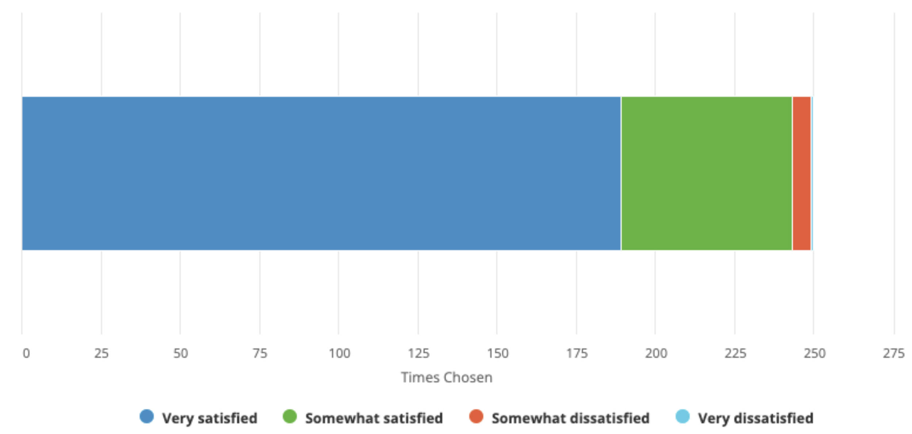

# 2021 Survey Results and 2022 Product Roadmap
Last September [we asked you](/blog/peeringdb_2021_user_survey/) for input through our anonymous satisfaction survey, so we could use it to guide our product roadmap for 2022. Today, we are sharing what you told us through the survey and how we’ll be improving PeeringDB and your experience of it in 2022.

## Highlights
We had almost 250 responses to the survey, a 25% increase on last year. As with last year, respondents identified themselves as connected with organizations operating on every continent and in every part of our industry. Overall satisfaction remains unchanged from last year.

We asked a few new questions in 2021 and learned:

* Almost 70% of respondents use PeeringDB every day or every week. Most of the rest use it every month.
* Under half of respondents use PeeringDB on a mobile device.
* About 70% of respondents want a way to be notified about changes that are relevant to them.

From the questions that were repeated from 2021 we learned that Network Configuration Data and Search and Discovery capabilities remained the most important to our users.

The User Experience and Web Interface remained the service categories with the lowest satisfaction, although 85% of respondents were still somewhat or very satisfied.

The other lower performing area was Documentation Quality, which is an area that we started to address later in 2021 and some respondents won't have known about. Work on improving [our documentation](/howtos/) will continue in 2022.

We hope that these improvements drive satisfaction in 2022.

## Roadmap
We have used your feedback, in combination with [a focus group consultation](/blog/carrier_object/), to guide our product roadmap for 2022. The three key focus areas will be:

### Introduce a new “Carrier” object
This object will describe providers of high capacity links between interconnection facilities. It was named “Carrier” during the discussion but that is a placeholder that could be changed if it is considered confusing or inappropriate. We are developing a design which will be circulated with the focus group before developing this new feature.

As a new object, we’ll make sure that it is well documented so users can get the most value from it.

### Improving the web site’s responsiveness
We recognize that the overall visual design needs some improvement. But perhaps more importantly we need to improve page load times. We plan to bring PeeringDB nearer to its users by completing deployment to a CDN. We have already tested this by deploying beta.peeringdb.com there and we will be moving www.peeringdb.com to it in 2022. We will also introduce modular page rendering, so each element loads via a separate connection, speeding the overall experience.

We will use the CDN metrics to learn more about how www.peeringdb.com is used and that will inform improvements to the visual design.

### Continue improving search
2021 saw significant improvements to advanced search and simple search. We will continue to make improvements to search and help users keep the underlying data more accurate.

One example of this is work that’s going on, as I type, at the NANOG 84 Hackathon where volunteer developers are introducing [intersection searches](https://github.com/peeringdb/peeringdb/issues/1020). That means you’ll be able to make a single query to find out which IXPs or interconnection facilities have two networks present, such as your own and a desired peer’s.

This is an example of how PeeringDB is developed by its users as well as the core team.

## What else? Data accuracy
We know that we need to do work to improve the quality of data in PeeringDB as it plays such an important role in configuration.

We last looked at this in 2019’s [Data Ownership Task Force](/taskforce/dataownership/#peeringdb-data-ownership-task-force), whose report acknowledged the shared responsibility for data describing the interconnected nature of separately managed parts of our Internet. We plan to work with PeeringDB users to renew our work in this area so we can continue to improve the quality of data we publish.

We are also setting course towards increased data accuracy by using the [RPKI](https://en.wikipedia.org/wiki/Resource_Public_Key_Infrastructure) and [Resource Signed Checklists](https://datatracker.ietf.org/doc/html/draft-ietf-sidrops-rpki-rsc) (RSC). We want to use RSC validation to cryptographically validate our users’ ability to control specific Internet Number Resources.

## Call to action
We just deployed two user developed features: [improvements to simple search](https://github.com/peeringdb/peeringdb/issues/1083) and [OpenID Connect](https://github.com/peeringdb/peeringdb/issues/1070) integration. We are keen to include more user developed code. If you’d like to contribute to PeeringDB then let me know and we can help you.

If you have an idea to improve PeeringDB you can share it on our low traffic [mailing lists](/#mailing-lists) or create an issue directly on [GitHub](https://github.com/peeringdb/peeringdb/issues). If you find a data quality issue, please let us know at [support@peeringdb.com](mailto:support@peeringdb.com).

---

PeeringDB is a freely available, user-maintained, database of networks, and the go-to location for interconnection data. The database facilitates the global interconnection of networks at Internet Exchange Points (IXPs), data centers, and other interconnection facilities, and is the first stop in making interconnection decisions.
