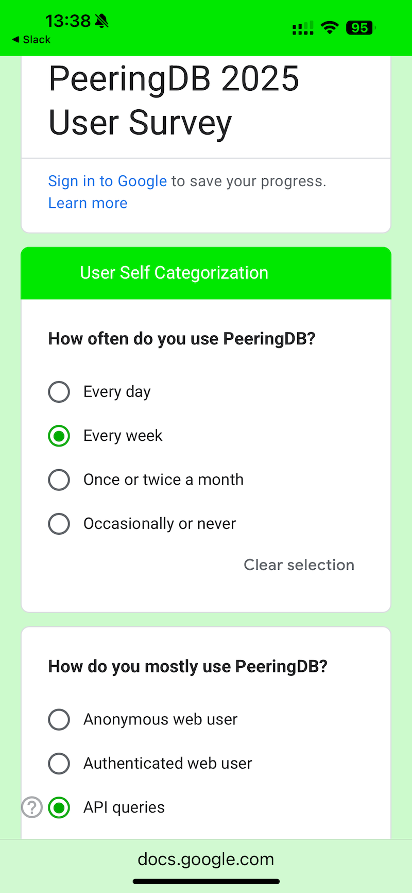

# PeeringDB’s 2025 User Survey

We’re running [an anonymous user survey](https://docs.google.com/forms/d/e/1FAIpQLSeU7oCd3ByYkMpi7omYAuNY5TqjpJ2-uR0lsQfpqZVRJSqvUw/viewform?usp=header) until the end of October. It’s been three years since our last survey. We paused for a bit because we were getting the same responses to our questions. We wanted to deploy changes before asking for your time again.

So, we’ve deployed changes. We now normalize location data, we’ve introduced new ways to search, and new types of data: carriers and campuses.

But don’t worry, that doesn’t mean lots of questions. There are just 11 and you don’t have to answer them all. And there’s lots of opportunity to leave comments – if you want to. Comments are often even more valuable than satisfaction ratings.

Dynamic web translation is now very good, so we’re just publishing the survey in English. You can use your favorite tool to translate the survey. And feel free to comment in the language you are happiest writing in.

We’re using the survey to find out if you know about new features, what you like best, and where you think we should focus our efforts. We’ll use your input to shape future plans.

As always, the survey is anonymous. We don’t ask for your address and we can’t associate responses with individuals.

So, please [share your thoughts](https://docs.google.com/forms/d/e/1FAIpQLSeU7oCd3ByYkMpi7omYAuNY5TqjpJ2-uR0lsQfpqZVRJSqvUw/viewform?usp=header) with us and help guide PeeringDB’s future.

If you have an idea to improve PeeringDB you can share it on our low traffic [mailing lists](https://docs.peeringdb.com/#mailing-lists) or create an issue directly on [GitHub](https://github.com/peeringdb/peeringdb/issues). If you find a data quality issue, please let us know at [support@peeringdb.com](mailto:support@peeringdb.com).

--- 

PeeringDB is a freely available, user-maintained, database of networks, and the go-to location for interconnection data. The database facilitates the global interconnection of networks at Internet Exchange Points (IXPs), data centers, and other interconnection facilities, and is the first stop in making interconnection decisions.