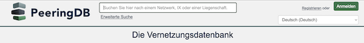

# PeeringDB in Your Preferred Language

Volunteers translate PeeringDB into [17 different languages](https://translate.peeringdb.com/projects/peeringdb/#languages). Some of those translations, like Romanian, are complete. Others, like Indonesian, have only just started.

Translation is important in making PeeringDB accessible to people around the world. 

But until now, you had to create an account – using the English language interface – to set your preferred language. We realized that this was not a perfect solution.

We are grateful to Daniel Van Allen of Google. He developed the code to make translation available to anonymous web users. Now, you can land on the homepage and select the language you want to use from the dropdown menu.

We hope that this will make PeeringDB accessible to more users. We also hope it will inspire people to volunteer to translate PeeringDB. If you want to volunteer, [you can contact us](https://translate.peeringdb.com/contact/).

If you have an idea to improve PeeringDB you can share it on our [low traffic mailing lists](https://docs.peeringdb.com/#mailing-lists) or create an issue directly [on GitHub](https://github.com/peeringdb/peeringdb). If you find a data quality issue, please let us know at [support@peeringdb.com](mailto:support@peeringdb.com).

--- 

PeeringDB is a freely available, user-maintained, database of networks, and the go-to location for interconnection data. The database facilitates the global interconnection of networks at Internet Exchange Points (IXPs), data centers, and other interconnection facilities, and is the first stop in making interconnection decisions.
