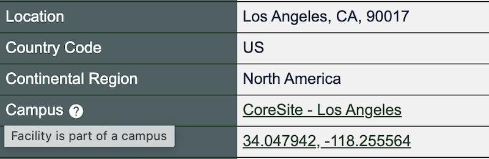
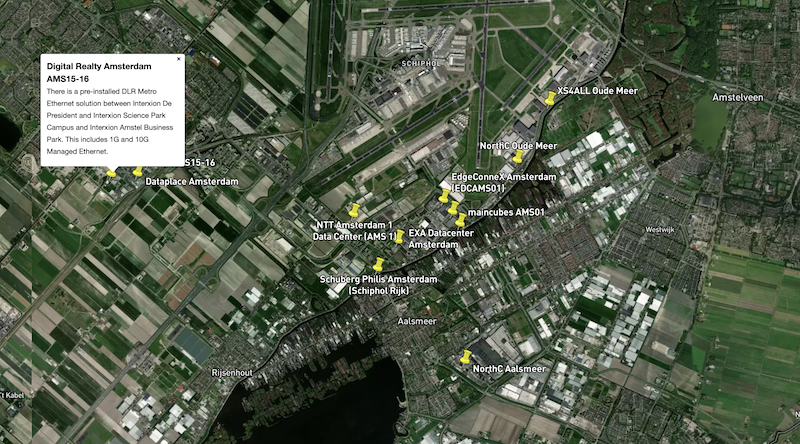

# See Locations in PeeringDB on a Map

We're making it easier for you to see where facilities are. It’s good to know how close facilities are to each other and anything else that’s important to you, like who and what is present there.

We have coordinates for every facility in PeeringDB. For instance, One Wilshire in Los Angeles is at 34.047942, -118.255564. When you click on the coordinates on our site, you go to a map view. But that just shows you that one facility.

Anyone who wants could use [our API](https://docs.peeringdb.com/api_specs/) to extract the coordinates for all facilities. They could then populate any map they want. But that can be hard to do from raw data.

We now produce a [.KMZ file](https://fileinfo.com/extension/kmz) every day. It's ideal if you want to populate a map or GIS tool with PeeringDB facility data. We have [linked to the file](https://public.peeringdb.com/peeringdb.kmz) from the footer of every page on the site. If you want fresh data on interconnection facilities around the world, grab a copy every day. If you want to explore a new area, grab a copy and open it in your favorite .KMZ viewer.

We have ideas for ways to improve the visualization of data in PeeringDB. But we want your input to guide us. Let us know what's most important to you, or the problems you need to solve.

[Contact the Product Committee](mailto:productcom@lists.peeringdb.com), share it on our [low traffic mailing lists](https://docs.peeringdb.com/#mailing-lists), or have a chat when you meet us at an event. Or create [an issue](https://github.com/peeringdb/peeringdb/issues) describing your need on GitHub. If you find a data quality issue, please let us know at [support@peeringdb.com](mailto:support@peeringdb.com).

---

PeeringDB is a freely available, user-maintained, database of networks, and the go-to location for interconnection data. The database facilitates the global interconnection of networks at Internet Exchange Points (IXPs), data centers, and other interconnection facilities, and is the first stop in making interconnection decisions.
