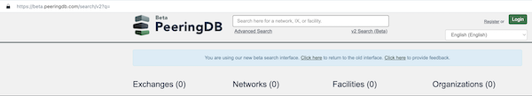
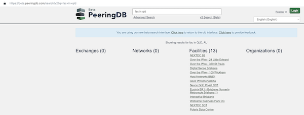
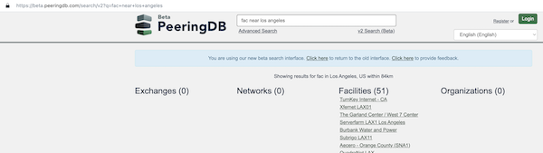

# Search Gets Better

Users tell us that search and the quality of the data in PeeringDB are their two top priorities.

We've previously written about using automation to improve data quality. We're now beta testing some improvements to search. You can test our new search interface now on [beta.peeringdb.com](https://beta.peeringdb.com/search/v2?q=).

You can use natural language words, like "near" and "in", when you query PeeringDB. That means you're not forced to use the radius feature in Advanced Search.

Martin Levy gave a use case when he opened [issue #479](https://github.com/peeringdb/peeringdb/issues/479). The radius search improved things. This is a further improvement. In any of the countries where we’ve normalized address data, you can search using a state name or its abbreviation. 

>In my retirement, I finally had the time to visit and enjoy Montana. It's a wonderful state replete with interesting wildlife and absolutely-stunning landscapes. The fact that you can now find an IXP in Montana with an easy search on PeeringDB's website makes me very happy. I don't think I need to do that search anymore; however, I'm glad others active in the industry can now do that style of search. I wish PeeringDB and the whole industry all the best! I'm happy that my April/2019 issue on GitHub (You can’t find an IXP in Montana; but you should be able to!) is now banished into the history books!
>
 *Martin Levy*

When you search for facilities near New York, you’ll get results for relevant locations in nearby New Jersey, just across the river. Similarly, searches for facilities near Los Angeles will extend south into Orange County.

None of this takes away the [Advanced Search tools](https://www.peeringdb.com/advanced_search). They are staying. But you can now find out about the scale of opportunities in a new area nice and quickly.

As our first image shows, we’re testing this new interface side-by-side with the old one. We’d like you to try it and tell us what you think. There’s a link to a feedback form at the top of the page. Please tell us what you like, what you'd like improved, or where our new search tool doesn't work properly.