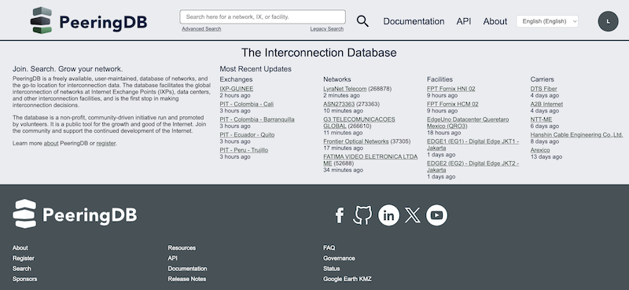
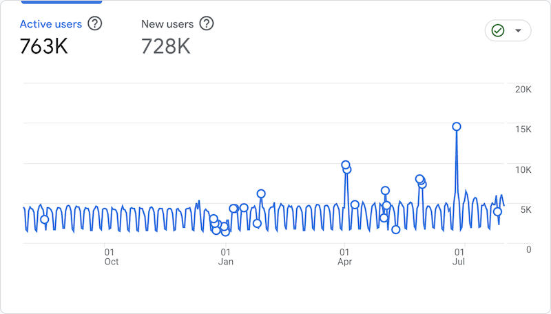
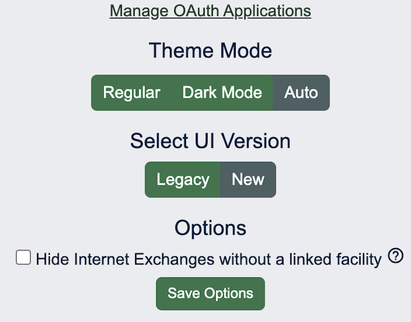

# September 2025 PeeringDB Product Update
## Strategy

This is our third half yearly update. We publish [notes with every release](https://docs.peeringdb.com/release_notes/) and promote new features and bug fixes on social media. These reports are an opportunity to step back and look at the broad sweep of change.

You can find our previous half yearly reports here: [one](https://docs.peeringdb.com/blog/october_2024_retrospective/), [two](https://docs.peeringdb.com/blog/april_2025_product_update/).

PeeringDB’s board approved a 50 percent increase in spending on development and operations work in 2025 from the 2024 level. All our committees have access to these development and operations resources. This means we can get more development work done each month and put more effort into operations improvements.

## People, process, and volunteer translations

Product Committee membership has stabilized and we are working more efficiently. We have much more asynchronous discussion, leading to faster decision times on change proposals.

We have a new translation available: Lithuanian. It was provided by Saulius Jeraminas and deployed in our August release.

We still encourage users to submit feature requests and bug reports [in GitHub](https://github.com/peeringdb/peeringdb/issues). We want to understand how feature developments can help our users. Please tell us whether you'd use a feature and how it would help. You can do this in GitHub, on [our mailing list](productcom@lists.peeringdb.com), or when you meet us at industry events.

## Last six months
### Comparison in Search

Users can now compare networks at facilities. This new feature was initially released in July and we’ve already had two great suggestions for improvements to it.

Based on the initial feedback we will add comparisons based on exchanges (IXPs) to augment the existing facility (data center) comparison. We’ll also show the countries where facilities are based and make the columns sortable.

### Web UI

We have started deploying our new web UI to users. We are using a staged approach. We’ve started by deploying to PeeringDB volunteers and we’ll next start opting in 20 percent of users, who will be able to opt out of UI testing. 

The goal of our web UI refinements is to make better use of the screen space we know that 80 percent of visitors have. We’ll also be adjusting the design to render better on the phones used in 20 percent of visits.

We have to do this as we’ve been adding columns to let users show things like BFD support. In some cases this has led to some elements obscuring others. One example is long IPv6 addresses being obscured.

We are working on refinements identified during the first stage of deployment. When those are deployed we’ll start opting users into the new design, allowing them to opt out if they prefer the old design.

### MFA Mandate
Anonymous use has not gone away and will remain. 

But if you want to authenticate, whether to get more queries or to make changes to data you control, you now have to have a second factor. That means:

* [API Keys](https://docs.peeringdb.com/howto/api_keys/) for API queries
* Backup codes
* Passkeys
* TOTP 
* U2F Hardware Tokens

We flagged this change well in advance and have not seen users locked out. Users can recover their account via email.

We saw a spike in users the week before the MFA mandate was imposed. But overall usage remains about the same as we’ve seen over the last year.

### Address Normalization
Over the last year we have been normalizing the presentation of addresses. We use both Google and Melissa for this and have now completed address normalization of four elements:

* Country names
* Provide/State names
* City names
* Street names

We have seen a few anomalies arising from normalization and will fix those in the coming weeks.

## Coming Up
### Website

You will be seeing our new web UI in the next few months. You might be opted in to test it. If you are and you don’t like it, you can go to your profile and choose to use the original design, while we refine the new one.

Once we have completed work on the search experience we will start improving the configuration and profile management parts of the site.

Once this is complete we’ll be implementing lazy loading to improve the speed at which text is displayed in your browser.

### Comparison

Enthusiastic early users of the ASN Comparison function have suggested some brilliant ways to improve it. We’ll be working on implementing these. We want your ideas. How can we improve this feature so it’s more useful to you when you do your job, or want to automate parts of it?

### Behind the Scenes

We are completing our transition to containers. We’re also implementing some service level indicators so we know if PeeringDB is up but loading slowly. We’ve had a couple of incidents recently where an enthusiastic developer has run code that hammers the site heavily. We’ll be working on ways to retain high availability despite users exceeding [query limits](https://docs.peeringdb.com/howto/work_within_peeringdbs_query_limits/).

And while we are working on PeeringDB’s website, we also make all the data available for query through a local mirror: `peeringdb-py`. It’s [been improved](https://docs.peeringdb.com/howto/peeringdb-py/) and is now even simpler to install and keep updated.

If you have an idea to improve PeeringDB you can share it on our [low traffic mailing lists](https://docs.peeringdb.com/#mailing-lists) or create an issue directly on [GitHub](https://github.com/peeringdb/peeringdb/issues/). If you find a data quality issue, please let us know at [support@peeringdb.com](mailto:support@peeringdb.com).

--- 

PeeringDB is a freely available, user-maintained, database of networks, and the go-to location for interconnection data. The database facilitates the global interconnection of networks at Internet Exchange Points (IXPs), data centers, and other interconnection facilities, and is the first stop in making interconnection decisions.