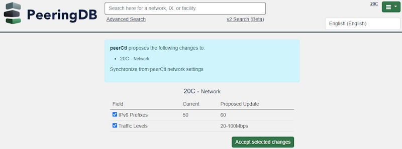

# Structured Data and more with PeeringDB

This describes our latest improvements and puts them in the context of recent feature developments.

PeeringDB users have told us that their top priorities are data quality and search. These priorities have guided recent improvements. We want to make it easier to keep PeeringDB current. We want users to be able to analyze data. And we want to make the data available to users in the way that works best for them.

[Our API](https://docs.peeringdb.com/api_specs/) has always meant that people can automate updates and get data in structured formats. And [peeringdb-py](https://docs.peeringdb.com/howto/peeringdb-py/), our local cache, lets you keep a local copy of our data. That makes it easy to keep queries local and integrate PeeringDB with other data sources.

But we've been working to add key features for web users.

Your internal source of truth can [suggest updates to PeeringDB](https://docs.peeringdb.com/blog/updates_from_an_internal_source_of_truth/). Once you set that up, you can review and approve or deny suggestions.

You can get PeeringDB data about [facilities as a .KMZ file](https://docs.peeringdb.com/blog/peeringdb_map_with_kmz/) as well as CSV or JSON. So you can import it into Google Earth and other GIS tools.

[Simple search](https://docs.peeringdb.com/blog/better_search_and_export/) understands a wide range of geographic terms. For instance, you can just search for an `ix in berlin` or a `fac in ke`. Yes, PeeringDB understands [ISO 3166-2](https://www.iso.org/obp/ui/#search) country codes.

 

And now you can export data from any page. Of course, you could always copy and paste. But copying and pasting the list of peers at [IX.br (PTT.br) São Paulo](https://www.peeringdb.com/ix/2086) is a big job. Grabbing its data as a CSV or JSON removes copy/paste errors. You can import it straight into a business analytics engine.x

Of course, it’s not all feature changes. We know that we need to update the web design, too. We have a preview of the design available for you to look at and comment on: [https://preview.beta.peeringdb.com](https://preview.beta.peeringdb.com)

Take a look and tell us what you like and what needs to be updated before we deploy this into production.

If you have an idea to improve PeeringDB you can share it on our low traffic [mailing lists](https://docs.peeringdb.com/#mailing-lists) or create an issue directly on [GitHub](https://github.com/peeringdb/peeringdb/issues). If you find a data quality issue, please let us know at [support@peeringdb.com](mailto:support@peeringdb.com).

--- 

PeeringDB is a freely available, user-maintained, database of networks, and the go-to location for interconnection data. The database facilitates the global interconnection of networks at Internet Exchange Points (IXPs), data centers, and other interconnection facilities, and is the first stop in making interconnection decisions.