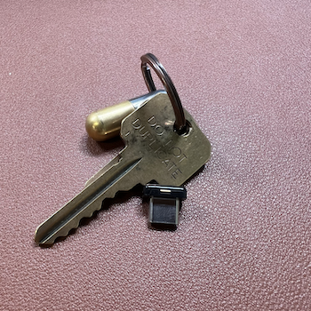
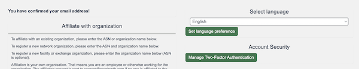

# Improve Your Account Security - And Check Our URL

We completed our support for FIDO U2F hardware tokens this month and have made [www.peeringdb.com](https://www.peeringdb.com) the canonical URL for our service. We’d like you to take advantage of two-factor security for your PeeringDB account. 

We also want to ensure you adjust any automation aimed at [https://peeringdb.com](https://peeringdb.com) so that it connects to [https://www.peeringdb.com](https://www.peeringdb.com) instead. This will ensure continuity of service for API users.

Your listing in PeeringDB is how you present your network, IXP, or facility to the world. If a miscreant gains access to your account they can misrepresent you. Reclaiming control of the objects you look after and undoing any changes the miscreant has made could be a lot of work. 

You can protect yourself against this risk by enabling two-factor authentication on your account.

We have supported industry standard Time-based One-Time Passwords, as defined in [RFC 6238](https://www.rfc-editor.org/rfc/rfc6238.html) for a while now. This is the protocol used by popular smartphone authenticator apps. We added support for FIDO U2F hardware tokens in Q1 2022. 

You enable 2FA in the Account Security section of your account settings. Click on the green button to Manage Two-Factor Authentication and you’ll be guided through the process. Just be aware that you’ll need a secure place to store your backup codes, so you can gain access to your account if you ever lose access to your authenticator app or U2F hardware token.

What are you waiting for? Improve the protection for your organization’s listing in PeeringDB today by enabling 2FA.

If you have an idea to improve PeeringDB you can share it on our low traffic [mailing lists](/#mailing-lists) or create an issue directly on [GitHub](https://github.com/peeringdb/peeringdb/issues). If you find a data quality issue, please let us know at [support@peeringdb.com](mailto:support@peeringdb.com).

--- 

PeeringDB is a freely available, user-maintained, database of networks, and the go-to location for interconnection data. The database facilitates the global interconnection of networks at Internet Exchange Points (IXPs), data centers, and other interconnection facilities, and is the first stop in making interconnection decisions.
