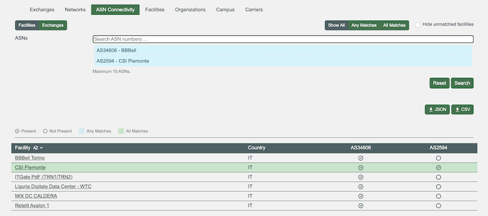
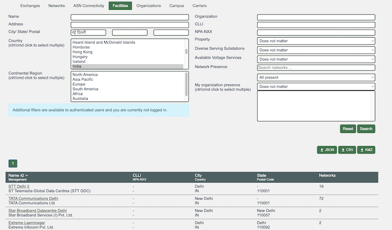
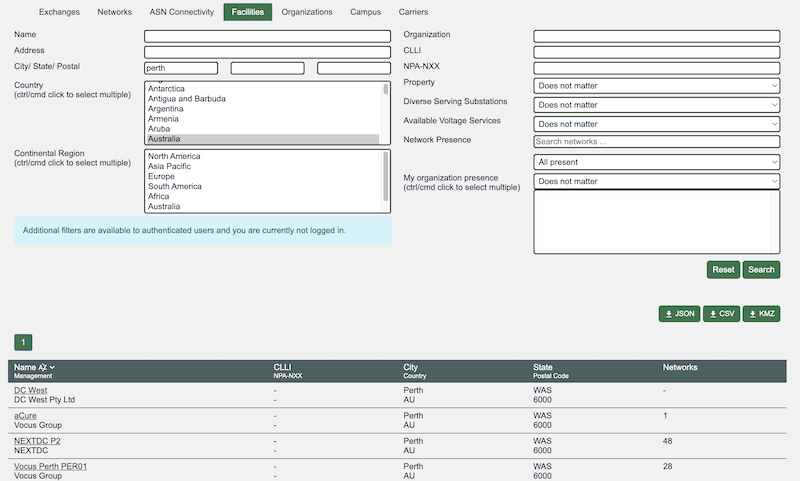
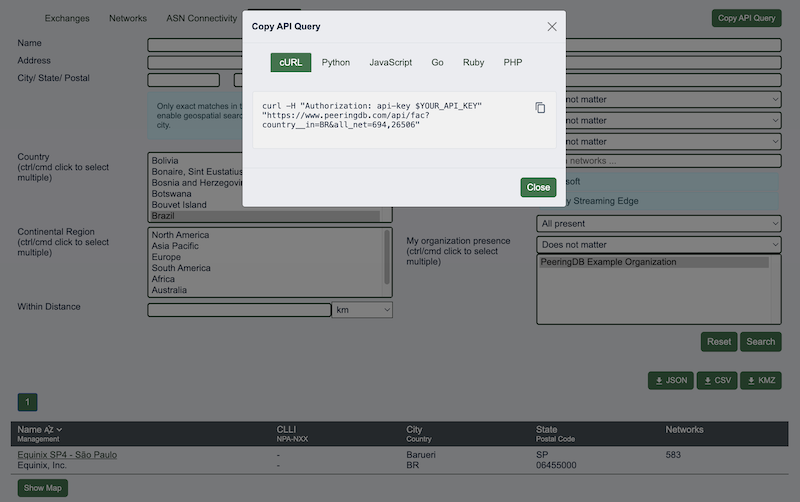

# PeeringDB Update October 2025 – April 2026

## This update

We publish [notes with every release](https://docs.peeringdb.com/release_notes/) and promote new features and bug fixes on social media. These reports are an opportunity to step back and look at the broad sweep of change.

You can find our previous half yearly reports here: [one](https://docs.peeringdb.com/blog/october_2024_retrospective/), [two](https://docs.peeringdb.com/blog/april_2025_product_update/), [three](https://docs.peeringdb.com/blog/sep_2025_product_update/).

## Operational Changes

We’ve now completed our transition to Kubernetes. This will allow us to scale faster when we need to.

We’ve also implemented rate limiting for unauthenticated web users. We saw unprecedented activity from automated web scrapers in late 2025. We had previously rate limited API users but not web users both because humans can’t search fast enough to be a problem and most people search once, get their result and move on.

But automated web scrapers did cause problems. They are now limited to 120 queries/minute and we’ll review and update this limit based on experience.

## ASN Comparison is Better

We’ve made several improvements to the ASN Comparison feature in [Advanced Search](https://www.peeringdb.com/advanced_search#asn_connectivity). You can now:

1. Input a list of ASNs as text or use our autocomplete function  
2. Do comparisons at both Exchanges and Facilities  
3. See the country matches are in  
4. Dynamically filter results on the page

## Data Quality

We have normalized more location data. We do this because it makes search and data analysis simpler when a single place has a single name. We also know that some users want to use a particular spelling, so we support multiple inputs.

We just normalize the presentation of data while allowing users to search for locations in any language. For example, you can search for interconnection facilities in київ but will see results for Kyiv.

We now normalize all countries to their ISO 3166 codes.

We normalize the presentation of internal divisions within countries, like provinces and states for some countries. We don’t do it for all countries as internal divisions aren’t always relevant. Please let us know if we need to improve location data normalization for a country.  

## Expanding the ‘copy an API query’ Feature

In March 2025 we added a feature that lets users get a properly formatted API query for basic queries. We’ve just expanded the feature to support Advanced Search. This makes the feature more useful and should help users get more from PeeringDB in less time.

As before, you can get queries formatted for curl, Python, JavaScript, Go, Ruby, and PHP. 

## Looking Forward

We are examining ways to support AI assisted software development for PeeringDB. We anticipate demand from users who will want to develop and add features, whether in the service we operate or in a local mirror used under the terms of [our AUP](https://www.peeringdb.com/aup).

A key concern will be ensuring that submitted code is thoroughly reviewed and tested before deployment. We want to weed out bugs before they hit production. We also want to protect the integrity of the service. We’ll provide updates on this in the [notes of our regular meetings](https://docs.peeringdb.com/committee/product/#meeting-notes), [on GitHub](https://github.com/peeringdb/peeringdb/issues), and in this blog.

If you have an idea to improve PeeringDB you can share it on our low traffic [mailing lists](https://docs.peeringdb.com/#mailing-lists) or create an issue directly on [GitHub](https://github.com/peeringdb/peeringdb/issues). If you find a data quality issue, please let us know at [support@peeringdb.com](mailto:support@peeringdb.com).

--- 

PeeringDB is a freely available, user-maintained, database of networks, and the go-to location for interconnection data. The database facilitates the global interconnection of networks at Internet Exchange Points (IXPs), data centers, and other interconnection facilities, and is the first stop in making interconnection decisions.