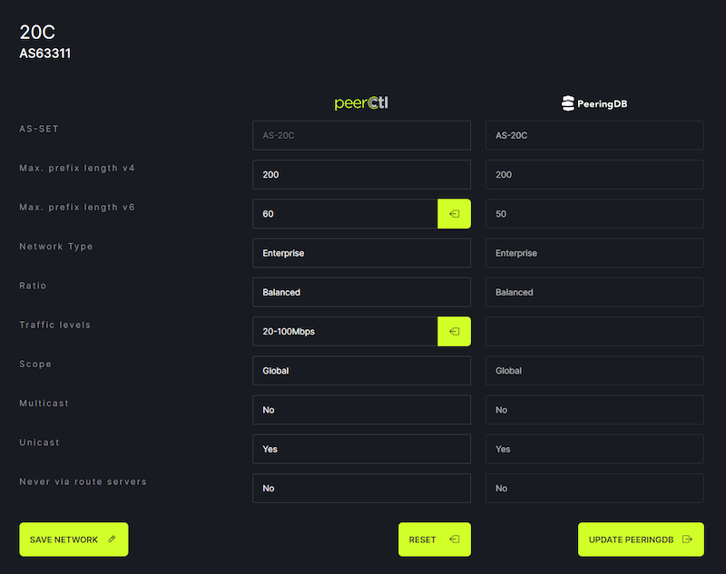
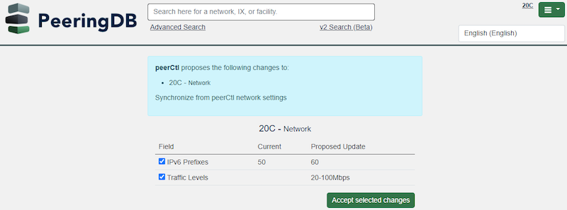
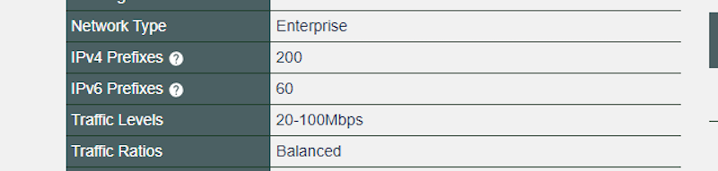

# Your Internal Source of Truth Can Now Push Updates to PeeringDB

We have [an API](/api_specs/). You can use our API to update PeeringDB as well as make queries. But most people don't want to hand craft API updates. Very few organizations have the scale that demands automating updates.

Until now, that left a gap. If your network connects at many facilities and IXPs, there might be a gap between a change happening and appearing in PeeringDB. Our users value the quality of configuration data in PeeringDB, so we wanted to fill that gap.

We used the [NANOG 87 Hackathon](/blog/nanog_87_hackathon_proof_of_concept/) as an opportunity to test a proof of concept. It went well, so we've put it into production. Your internal source of truth can now suggest updates to PeeringDB. You then login to our web interface and approve or reject those changes.

FullCtl, who [participated in the Hackathon challenge](https://www.fullctl.com/blog/NANOG87Hackathon), has already implemented support for this new feature. 

This new feature means you can have automation monitor the gap between your internal source of truth and PeeringDB. And you don't need to give that tool credentials to push updates to PeeringDB.

Benefits include:

- Simplified user interface for changes
- Human oversight 
- Third party tools do not need to be given credentials with write permission

"*It's great when you see a project that's become as important and successful as PeeringDB continue to innovate and improve. We're super stoked to be the first of what I'm sure will be many apps to support this new feature - which is sure to increase the already amazing amount of high quality interconnection data available in PeeringDB, supporting global interconnection.*"
Chris Grundemann, Co-Founder & CEO, FullCtl

We’d love to see more updates coming in from more sources of truth!

If you have suggestions, [contact the Product Committee](mailto:productcom@lists.peeringdb.com), share them on our [low traffic mailing lists](https://docs.peeringdb.com/#mailing-lists), or have a chat when you meet us at an event. Or [create an issue](https://github.com/peeringdb/peeringdb/issues) describing your need on GitHub. If you find a data quality issue, please let us know at [support@peeringdb.com](mailto:support@peeringdb.com).

--- 

PeeringDB is a freely available, user-maintained, database of networks, and the go-to location for interconnection data. The database facilitates the global interconnection of networks at Internet Exchange Points (IXPs), data centers, and other interconnection facilities, and is the first stop in making interconnection decisions.
