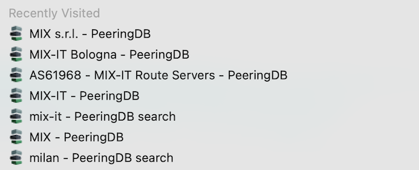

# User suggestions improve PeeringDB usability

Some people are heavy PeeringDB users. They research and compare options, with many PeeringDB tabs open at once. But finding the PeeringDB tab you want meant looking at each one. 

But no more. 

Marco d'Itri wrote to the [Product Committee](mailto:productcom@lists.peeringdb.com) and suggested an improvement:

> I believe that it would be great to have the HTML `<title>` tag of the pages show more that just "PeeringDB", e.g. "PeeringDB: AS65454". This simple change would allow to find previously visited pages in the browser history and search box.

We deployed this feature in [our March release](https://docs.peeringdb.com/release_notes/#release-2450). Each page now has its key feature set as a search term. That's the AS Number for networks, or the name elsewhere. We set the whole search string as the page title for advanced searches.

We hope this improves your PeeringDB web experience. 

If you have an idea to improve PeeringDB you can share it on our [low traffic mailing lists](https://docs.peeringdb.com/#mailing-lists) or create an issue directly [on GitHub](https://github.com/peeringdb/peeringdb). If you find a data quality issue, please let us know at [support@peeringdb.com](mailto:support@peeringdb.com).

--- 

PeeringDB is a freely available, user-maintained, database of networks, and the go-to location for interconnection data. The database facilitates the global interconnection of networks at Internet Exchange Points (IXPs), data centers, and other interconnection facilities, and is the first stop in making interconnection decisions.

