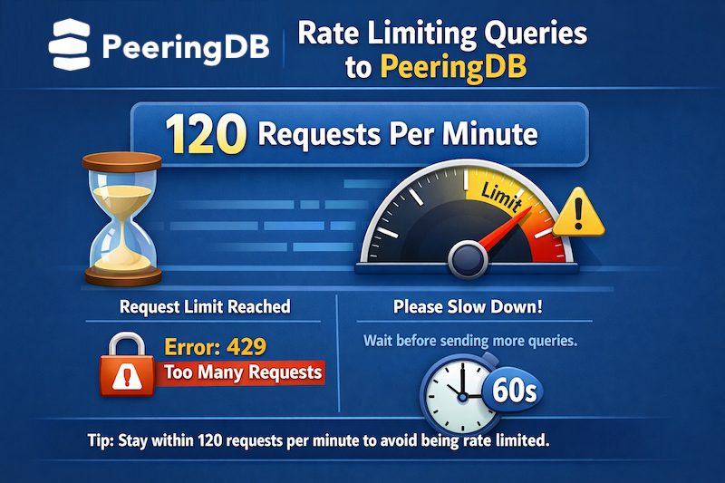

# Web rate limiting for unauthenticated users

Unauthenticated website access is now rate limited. Logged in users aren't rate limited.

API calls [have been rate limited](https://github.com/peeringdb/peeringdb/issues/853) since 2022. We did this in combination with outreach to users to tackle broken and poorly designed scripts, and some abuse. We didn’t add rate limiting to the website for two reasons: human users can’t work fast enough to be a problem and most users get the answer to their query and move on.

But the website suffered from an influx of automated scrapers in the second half of 2025. These users took a disproportionate amount of resources, impacting other users’ experience. We [got requests](https://github.com/peeringdb/peeringdb/issues/1835) for infrastructure improvements.

Introducing rate limiting for unauthenticated website users is one of several changes we are making to improve overall performance.

The first was to complete the move to containers, allowing us to scale horizontally much more quickly when we need to. This configuration change is another. We’ll also be serving PeeringDB from [additional locations](https://github.com/peeringdb/peeringdb/issues/1865).

We now rate limit unauthenticated web users to 120 requests per minute per IP address. We’ll review and update this limit based on experience.

We are making these changes to improve service reliability. But we also offer a local cache you can sync with PeeringDB and query locally. Using [`peeringdb-py`](https://docs.peeringdb.com/howto/peeringdb-py/) or an equivalent local cache will always give you the fastest response because it’s running where you are.

The improvements we make are only as good as the requests we get from you. We want to make sure that we understand what you need and why. If you have an idea to improve PeeringDB you can share it on our low traffic [mailing lists](/#mailing-lists) or create an issue directly on [GitHub](https://github.com/peeringdb/peeringdb/issues). If you find a data quality issue, please let us know at [support@peeringdb.com](mailto:support@peeringdb.com).

---

PeeringDB is a freely available, user-maintained, database of networks, and the go-to location for interconnection data. The database facilitates the global interconnection of networks at Internet Exchange Points (IXPs), data centers, and other interconnection facilities, and is the first stop in making interconnection decisions.