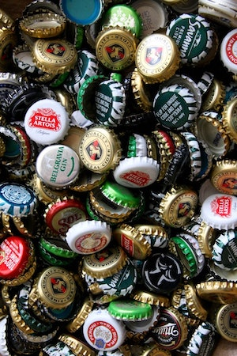

#Your Logo Goes Here!
We’ve just deployed 2.31.0-beta and it’s an opportunity to test out how your logo will look alongside your organization’s name. 

Make sure you have your logo ready. Logos can have a height of up to 75 pixels and a width of up to 150. They must be uploaded in JPG, JPEG, or PNG. Log in to beta.peeringdb.com, upload your logo and check that it shows up well.

This release didn’t just add one feature. We have also made improvements for search, ix’s, and facilities.

* Facilities can now specify a continental region, so searchers don’t need to specify countries one at a time on the advanced search page. 
* We added dynamic summaries and facilities.
* ASNs are now displayed at the top of search results for numeric queries.
* Sales contacts can now be added to IX objects

If you have an idea to improve PeeringDB you can share it on our [low traffic mailing lists](https://docs.peeringdb.com/#mailing-lists) or create an [issue](https://github.com/peeringdb/peeringdb/issues) directly on GitHub. If you find a data quality issue, please let us know at support@peeringdb.com. 

--- 

PeeringDB is a freely available, user-maintained, database of networks, and the go-to location for interconnection data. The database facilitates the global interconnection of networks at Internet Exchange Points (IXPs), data centers, and other interconnection facilities, and is the first stop in making interconnection decisions.
