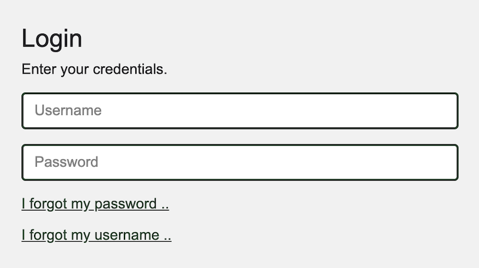

# HOWTO: Authenticate to PeeringDB

This article explains the authentication mechanisms we offer. It also explains how organizations can apply policies for their affiliated users.

## Why authenticate?

You don't need to login to make single queries to PeeringDB. But some features do require you to authenticate.

### Update the database

If you want to make updates then you need to authenticate. You can update PeeringDB via the API if you want. So you can either login to the website to make changes, or automate them with tools if you prefer.

### Access contact data

We encourage you to publish contact information for your facility, IXP, or network. You can choose to make contact information public but many organizations limit it to other PeeringDB users. So you’ll need to authenticate if you want access to most contact information.

### Higher query limits

Authenticated users are allowed more frequent API queries. They are also able to repeat an identical API query more frequently without being throttled.

### Help PeeringDB’s operations team

If you authenticate when you send queries, we can contact you if your PeeringDB use starts to cause an unexpected problem. If you don’t authenticate then all we can do is restrict queries from your IP address.

## Password

You must set a password.

Passwords must be at least 10 characters long and must not exceed 1,000 characters.

We recommend using a randomly generated password or passphrase.


## Multi-factor authentication (MFA)

We support three MFA methods. You can use:

* A time-based one-time password, as defined in [RFC 6238](https://www.rfc-editor.org/rfc/rfc6238.html)
* A [FIDO U2F](https://fidoalliance.org/specs/fido-u2f-v1.2-ps-20170411/) hardware token
* A [Passkey](https://www.passkeycentral.org/introduction-to-passkeys/how-passkeys-work)

You can choose to have more than one second factor configured. 

You can also download and securely store backup codes, in case a second factor is destroyed.

You can configure these in your account profile.

## Account recovery

You can recover your account if you forget your username or password. Just go to the login screen and click on the relevant link. An account recovery message will be mailed to you.




## OAuth

Some external services allow or require you to authenticate using your PeeringDB account. One example is networks' peering portals. They might use PeeringDB's OAuth service to ensure they can automate configuration.

We have a [guide to implementing PeeringDB's OAuth service](https://docs.peeringdb.com/oauth/) for your application.

## Automating PeeringDB access

### API keys

We support both user and organizational API keys. You should use organizational API keys when you don't want to tie your application to an individual.

We have [a detailed guide](/howto/api_keys/) on how to create, configure, and use API keys.

### Authentication HTTP header

The HTTP authentication header must use the same character set the connection is using.

This example shows a request and HTTP response:

```
$ curl -v -sG https://www.peeringdb.com/api/net/416 -H 'Authorization: Api-Key example.valid_apikey' 2>&1 | grep \<\ HTTP
< HTTP/2 200
```

This example shows what happens if the API key is not authorized:

```
$ curl -v -sG https://www.peeringdb.com/api/net/416 -H 'Authorization: Api-Key example.invalid_apikey' 2>&1 | grep \<\ HTTP
< HTTP/2 401
```

### Canonical URL

The canonical URL for PeeringDB is `https://www.peeringdb.com`. There is a redirect from `https://peeringdb.com` but we strongly encourage use of the canonical URL since industry practice in software packages is to drop the authentication header upon redirect, as a safety precaution.

### Password authentication

Using an API key for command line access is simple and more secure. Our [guide on API keys](/howto/api_keys/) explains how to create and manage keys, including setting read-only permissions, with examples.

## Improving this HOWTO

Please let us know how we could improve this article. Send a mail to the [Outreach Committee](mailto:outreachcom@lists.peeringdb.com).