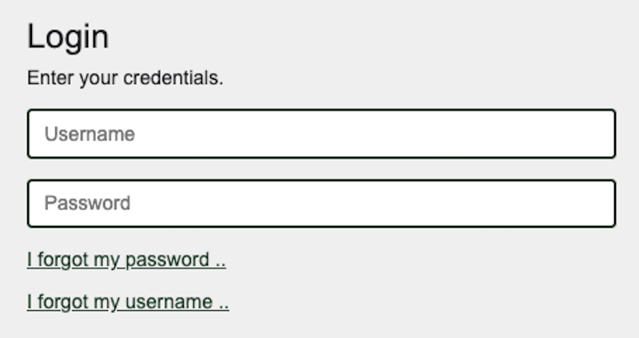
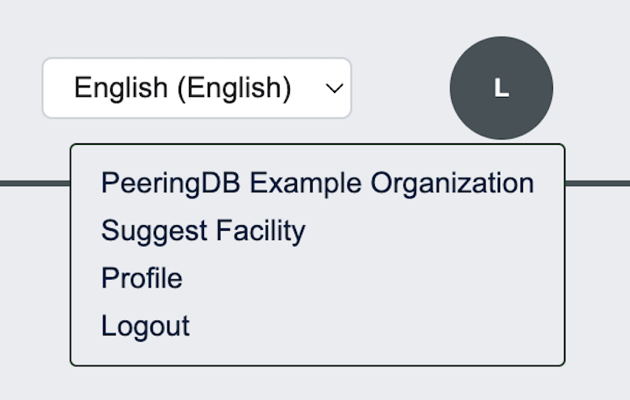
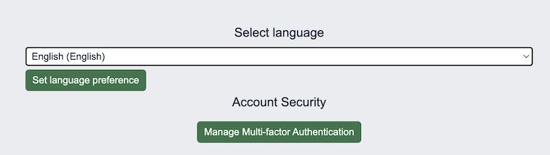
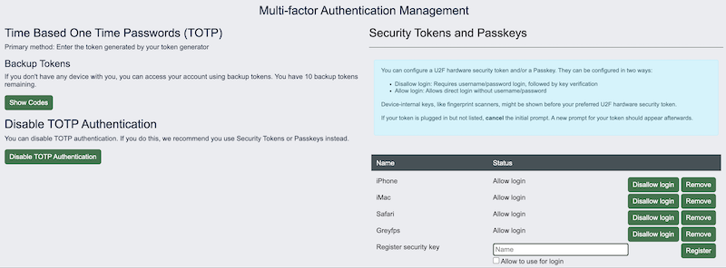

# HOWTO: Turn on 2FA and Require Users to Enable It

## What is 2FA?

2FA is two-factor authentication, also known as Multi-factor authentication. It means you use a password and a second factor.  

All PeeringDB users must have at least one second factor.

We support three types of 2FA: 

* [TOTP](https://en.wikipedia.org/wiki/Time-based_one-time_password)
* [U2F tokens](https://fidoalliance.org/specifications/)
* [Passkeys](https://www.passkeys.com/what-are-passkeys)

There are many popular software and hardware devices supporting these standards.

If you lose your second factor, or have not set one yet, you'll need to follow the password reset route.

 
## How do users enable 2FA?

Click on your account name and select your profile.

Then select the button for managing Multi-factor Authentication in the column on the right.

Then, add the methods you want. You can select multiple methods.

## How do organizations require users to enable it?

All PeeringDB users must have at least one factor in addition to their password. Organizations cannot vary this policy.

## Improving this HOWTO

Please let us know how we could improve this article. Send a mail to the [Outreach Committee](mailto:outreachcom@lists.peeringdb.com).