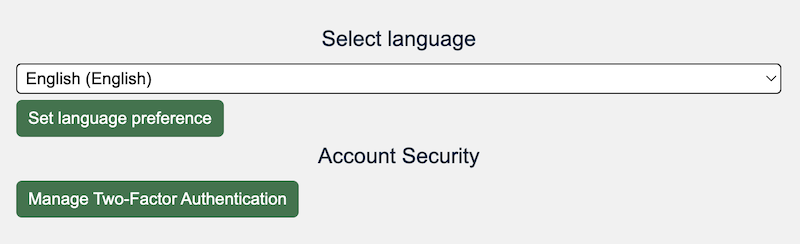
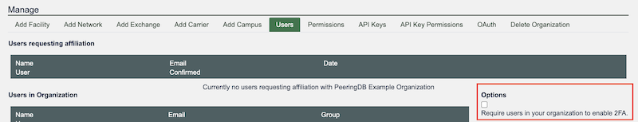

# HOWTO: Turn on 2FA and Require Users to Enable It

## What is 2FA?

2FA is two-factor authentication. Enabling 2FA for PeeringDB means you must both have an account password and another factor.

We support both [TOTP](https://en.wikipedia.org/wiki/Time-based_one-time_password) and [U2F tokens](https://fidoalliance.org/specifications/) as additional factors. There are many popular software and hardware devices supporting these standards.
 
## How do users enable 2FA?

Click on your account name. Then click on the green "Manage Two-Factor Authentication" box and follow the instructions.

## How do organizations require users to enable it?

In the Manage panel at the bottom of the screen, select the Users tab and check the box "Require users in your organization to enable 2FA."

