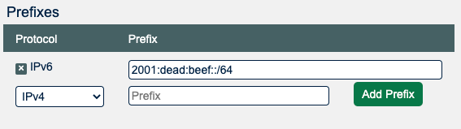

# HOWTO: Get Started with PeeringDB as an Exchange Operator

## About PeeringDB
PeeringDB, as the name suggests, was set up to facilitate peering between networks and peering coordinators. In recent years, the vision of PeeringDB has developed to keep up with the speed and diverse manner in which the Internet is growing. The database is no longer just for peering and peering related information. It now includes all types of interconnection data for networks, clouds, services, and enterprise, as well as interconnection facilities that are developing at the edge of the Internet.

We believe in, and rely on the community to grow and improve the PeeringDB database. The volunteers who run the database are passionate about security, privacy, integrity, and validation of the data in the database. Even though PeeringDB is a freely available and public tool, users strictly adhere to the acceptable use policy, which prevents the database from being used for commercial purposes and discourages unsolicited communications. This is largely policed by the community and has been very effective since PeeringDB was launched.

## Why?
PeeringDB is the interconnection database. Registering information about your exchange in PeeringDB makes it visible to network operators who want to peer with others across your fabric. 

## Getting started
Routine use of PeeringDB can be automated using [our API](https://www.peeringdb.com/apidocs) but this document is intended to help new exchange operators get started. Most exchange networks get set up using the web interface and then use the API to automate things that change regularly. This document focuses on the key steps for establishing your exchange’s presence in PeeringDB and assumes you are using the web interface, which is available in 14 languages.

If you need additional help getting started, please contact us at: [support@peeringdb.com](mailto:support@peeringdb.com).

## Information required
You will need to create several database records, known as objects, to establish your presence in PeeringDB. 

Database objects organize relevant information and document your exchange’s current participants, making it attractive to new ones. Most information is optional but sharing all the relevant information maximises the benefit you get from listing in PeeringDB. 

You can create your entry with the minimum required data and add and update the information you share over time. To maximize the value of your entry in PeeringDB you’ll probably want to include more than the minimum required information. This information is required:

* Company Name
* IPv4 and IPv6 Prefixes
* Three ASNs ready to peer at the exchange, not including IXP's route servers or own ASN
* Contact information

This information is not required but is useful:

* Facilities, where your service is available
* Link to traffic statistics
* Geographical information: city/country/continental region. That will help networks locate your exchange.

Some exchanges share additional information. You can look at the information shared by other exchange operators to work out what your organization should be sharing.

## Information about connected networks

You can provide information about the networks that will be peering at your exchange using the [X-F Member Export JSON Schema](https://github.com/euro-ix/json-schemas). We also [support this format](https://docs.peeringdb.com/ix-f-json-import-rules/) as a way to automate updates about your exchange to PeeringDB.  

Software for IXPs will generate this file for you but when you have just a few peering networks, you can create it in a text editor.

## Database records to create

### User
The `org` is the parent for the IX but you will need to start the process by creating a user account. If you use a role account for a PeeringDB user you should update the password when people who had access to the role account leave your organization. If you use a ticketing system, please make sure it does not auto-respond in a way that generates a slew of new tickets.

### Org
The `org` object is your organization’s core record in PeeringDB. All it needs is an organization name but you can add extra value by including information about where your organization is located. You could specify as little as a country name or as much as a full postal address.

Your `org` object will be assigned a numeric identifier, called its id. This is what will be referenced by any child net objects.

### Ix
Once you have created your organization you may add the `ix` object. You do this by using the Add Exchange tab in the “Manage” menu below your organization. You’ll be able to input either your IPv4 or IPv6 LAN prefix through this form and will then need to add the other by editing the object once it is created.

### Prefixes
An IPv4 or IPv6 prefix is needed to register your IX. Once your IX is approved, please also provide the other prefix. For the IPv6 prefix a /64 mask is highly recommended. Please talk to [support](mailto:support@peeringdb.com) if you would like to use another mask. The prefix information is used to verify connections from your participants. 

## Next steps
This short document describes the first steps for getting set up in PeeringDB. Once you have established your presence you should consider sharing information that would be helpful to potential new participants. Things to consider sharing:

* Encourage your exchange participants to add PeeringDB entries when they join, leave or upgrade the capacity they have with the exchange 
* We recommend you automate the process of publishing details about networks that peer at your exchange using an [IX-F JSON export](https://github.com/euro-ix/json-schemas). For that provide an URL at “IX-F Member Export URL” and enable the import. The visibility flag lets you set who is able to see your URL. And the “Preview” button pops a new window showing what actions the next import causes. Many networks are building automation that relies on PeeringDB. If networks peering at your exchange don't have an up to date PeeringDB record this might stop their automation configuring sessions.
* Use the “MTU” field to specify the MTU at your exchange.
* The field “DOT1Q” may go away, so it is not recommended to use it.

## More information
The [PeeringDB Data Ownership Policy](https://docs.peeringdb.com/gov/misc/2020-04-06_PeeringDB_Data_Ownership_Policy_Document_v1.0.pdf) describes all the objects in PeeringDB.

## Improving this HOWTO

Please let us know how we could improve this article. Send a mail to the [Outreach Committee](mailto:outreachcom@lists.peeringdb.com).
