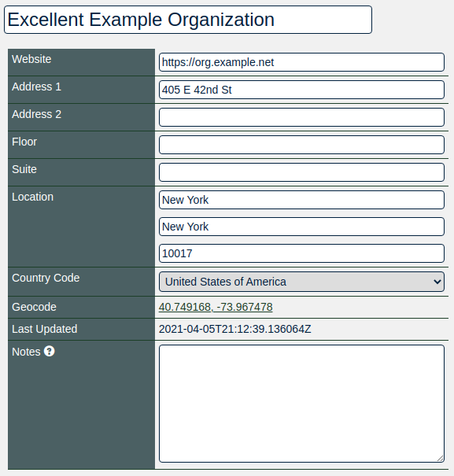
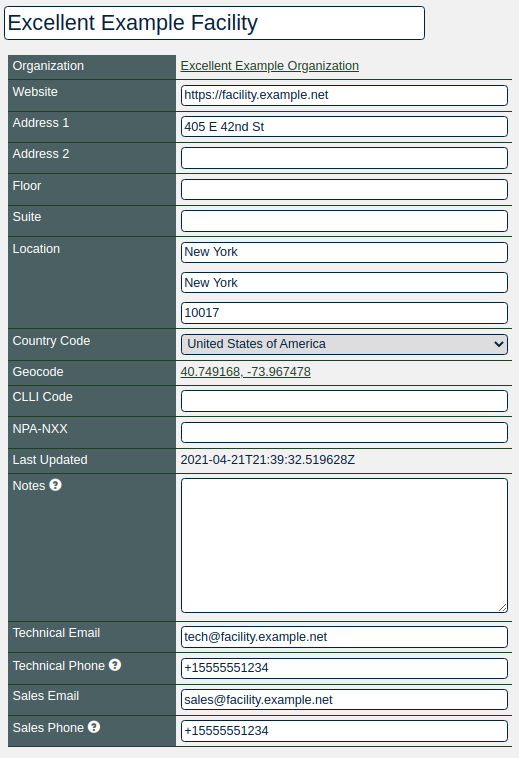
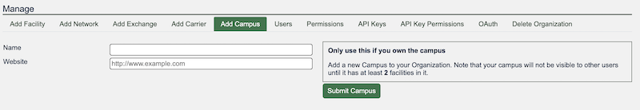

# HOWTO: Get Started with PeeringDB as a Facility or Campus Operator 

New to PeeringDB? See [About PeeringDB](../index.md) for background on what it is and who runs it.

## Why?
PeeringDB is the interconnection database. Registering information about your facility in PeeringDB makes it visible to network operators who want to connect to exchanges or other networks in your facility. 

## Facility qualification & approval criteria

Not every location qualifies as a `facility` object. Before you apply, make sure your facility meets all of the following:

* **Ownership & operation** — the facility must be owned and operated by your organization.
* **Public colocation** — it must openly offer colocation or meet-me-room services to the general public as unbundled services.
* **Multi-carrier interconnection** — it must support access to more than a single carrier option, so networks located there can interconnect with each other.
* **Public documentation** — your website must explicitly list colocation or meet-me-room services and the facility's physical address.

The following are **not** eligible as a `facility`:

* A tenant space within a larger data center (the facility object should be submitted by the organization that owns and operates the building)
* An office or point-of-presence
* A site offering only a single carrier option
* A location that only hosts your own services or your customers' services privately, without offering colocation to the public

## Getting started
Routine use of PeeringDB can be automated using [our API](https://www.peeringdb.com/apidocs) but this document is intended to help new facility administrators get started. Facilities are set up using the web interface. Once this is done you can use the API to automate things that change regularly. This document focuses on the key steps for establishing your facility's presence in PeeringDB and assumes you are using the web interface, which is available in 14 languages.

If you need additional help getting started, please contact us at: [support@peeringdb.com](mailto:support@peeringdb.com).

## Information required
You will need to create several database records, known as objects, to establish your presence in PeeringDB. 

Database objects organize relevant information. Your facility’s current participants can add their presence in your facility, making it attractive to others. Most information is optional but sharing all the relevant information maximizes the benefit you get from listing in PeeringDB. 

You can create your entry with the minimum required data and add and update the information you share over time. To maximize the value of your entry in PeeringDB you’ll probably want to include more than the minimum required information. This information is required:

* Company Name
* Full street address

This information is not required but is useful:

* AKA - If your facility has an alternative name you can show it here to improve visibility in searches
* Long name - If your facility has a long name, you can show it here to improve visibility in searches
* Floor - If your facility does not fill an entire building
* Suite - If your facility does not fill an entire building
* CLLI - this is a location code used in parts of the US telecommunications industry and is most useful to facilities located in the USA
* Notes - this field, which supports [Markdown](https://daringfireball.net/projects/markdown/), can be used to describe the characteristics of your facility that would be most useful to PeeringDB users

You can look at the information shared by other facility managers to work out what your organization should be sharing.

## Database records to create

Follow these steps in order — each object depends on the one before it.

### 1. Create a user account
The `org` is the parent for the facility but you will need to start the process by creating a user account. 

Once created, you will login using your username, password, and second factor.

You can associate more than one address with your account when you've created it.

If you use a role account for a PeeringDB user you should update the password when people who had access to the role account leave your organization. If you use a ticketing system, please make sure it does not auto-respond in a way that generates a slew of new tickets.

### 2. Create your org
The `org` object is your organization’s core record in PeeringDB. All it needs is an organization name but you can add extra value by including information about where your organization is located. You could specify as little as a country name or as much as a full postal address.

Your `org` object will be assigned a numeric identifier, called its `id`. This is what will be referenced by any child facility object.

### 3. Create your facility
Once you have created your organization you may add the `facility` object. You do this by using the Add Facility tab in the “Manage” menu below your organization.

### 4. (Optional) Create a campus
A `campus` is two or more facilities owned by the same organization where customers can get inter-facility cross-connects.

When you have two facilities you can create a `campus` using the Add Campus tab in the “Manage” menu below your organization.

PeeringDB relies on facility operators to decide whether their interconnected facilities should be listed as a campus. 

Facilities need to be within 50 kilometers of each other. The software enforces this limit to help users avoid configuration mistakes. 

## Next steps
This short document describes the first steps for getting set up in PeeringDB. Once you have established your presence you should consider sharing information that would be helpful to potential new participants. Things to consider sharing:

* Encourage the networks and Internet Exchanges to also register with PeeringDB, and to indicate their presence in your facility. Thus making their presence visible to others and so increasing the possibility of interconnection with other networks. 

## Deleting a facility

!!! warning "Facilities with active connections can't be deleted"
    PeeringDB blocks deletion of a `facility` object as long as any network or IXP still lists a presence there. If you need to remove a facility, first unlink or migrate those connections. If the facility has been abandoned or has a new owner, contact [support@peeringdb.com](mailto:support@peeringdb.com) and explain the situation.

## More information
The [PeeringDB Data Ownership Policy](https://docs.peeringdb.com/gov/misc/2020-04-06_PeeringDB_Data_Ownership_Policy_Document_v1.0.pdf) describes all the objects in PeeringDB.

## Improving this HOWTO

Please let us know how we could improve this article. Send a mail to the [Outreach Committee](mailto:outreachcom@lists.peeringdb.com).
