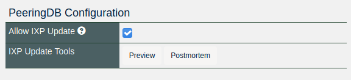
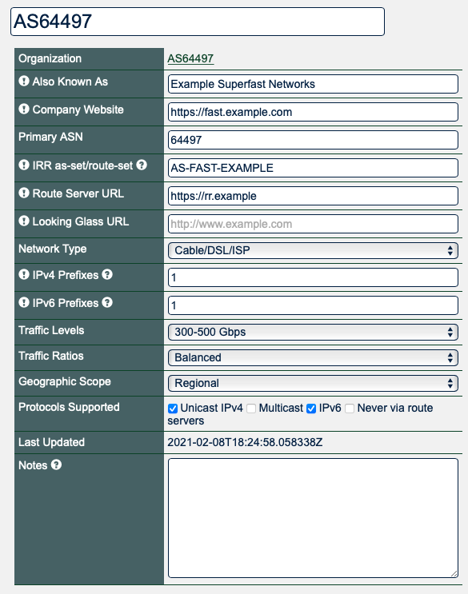

# HOWTO: Get Started with PeeringDB as a Network Operator

## About PeeringDB
PeeringDB, as the name suggests, was set up to facilitate peering between networks and peering coordinators. In recent years, the vision of PeeringDB has developed to keep up with the speed and diverse manner in which the Internet is growing. The database is no longer just for peering and peering related information. It now includes all types of interconnection data for networks, clouds, services, and enterprise, as well as interconnection facilities that are developing at the edge of the Internet.

We believe in, and rely on the community to grow and improve the PeeringDB database. The volunteers who run the database are passionate about security, privacy, integrity, and validation of the data in the database. Even though PeeringDB is a freely available and public tool, users strictly adhere to the acceptable use policy, which prevents the database from being used for commercial purposes and discourages unsolicited communications. This is largely policed by the community and has been very effective since PeeringDB was launched.

## Why should I add my network?
Almost one-third of Autonomous System Numbers (ASNs) register their interconnection data in the PeeringDB database. That means, by using PeeringDB and adding your own interconnection data, you’ll be able to confidently find information about networks looking to interconnect, where and how to connect with them, and they’ll be able to find the same information about your network. Since the database is user-maintained and validated by our volunteers, you can trust that the information is accurate and up-to-date.

This data will help you to accelerate the process of finding and connecting with other networks while supporting a faster and more decisive deployment of your own network expansion and development plans.

Many networks are building automation that relies on PeeringDB. If you don't have an up to date PeeringDB record this might stop their automation configuring sessions.

## Getting started
Routine use of PeeringDB can be automated using [our API](https://www.peeringdb.com/apidocs) but this document is intended to help new networks get started. Most networks get set up using the web interface and then use the API to automate things that change regularly. This document focuses on the key steps for establishing your network’s presence in PeeringDB and assumes you are using the web interface, which is available in 14 languages.

If you need additional help getting started, please contact us at: <support@peeringdb.com>.

## Information required
You will need to create several database records, known as objects, to establish your presence in PeeringDB. 

Database objects organize relevant information and document the connections making your network attractive to potential peers. Most information is optional but the less you share the less likely your network will benefit from listing itself in PeeringDB. 

You can create your entry with the minimum required data and add and update the information you share over time. To maximize the value of your entry in PeeringDB you’ll probably want to include more than the minimum required information. This information is required:

* Company name
* AS number
* Contact information (mandatory for networks with a connection to an Internet Exchange)

This information is not required but is useful:

* IRR information
* Network type
* Network operational area (so-called geographic scope)

Some networks share additional information. You can look at the information shared by your peers and potential peers to work out what your network should be sharing.

## Database records to create
Some objects have a notes field to share additional information. You can use [Markdown](https://daringfireball.net/projects/markdown/) formatting for the notes to make them more readable.

### User
The `org` is the parent for the network but you will need to start the process by creating a user account. We recommend that you use an e-mail address that exists in the publicly available contact information for the network’s ASN so that we can automatically validate your affiliation with the network. If you use a role account for a PeeringDB user you should update the password when people who had access to the role account leave your organization. If you use a ticketing system, please make sure it does not auto-respond in a way that generates a slew of new tickets.

### Org
The `org` object is your organization’s core record in PeeringDB. All it needs is an organization name but you can add extra value by including information about where your organization is located. You could specify as little as a country name or as much as a full postal address.

Your `org` object will be assigned a numeric identifier, called its `id`. This is what will be referenced by any child net objects.

### Net
Basic network information is automatically retrieved from the RIR or NIR’s database based on the AS Number. Brand names or other identifiers can be listed in the `aka` field. For example:

`name: Example Org Legal Entity`

`aka: Example Superfast Networks, Example Reliable Hosting`

### Permissions to grant
Once you are up and running you can create POC (Point of Contact) objects for functional contacts with your network. Not all networks need all POCs. These are:

* Abuse
* Maintenance
* NOC
* Policy
* Public Relations
* Sales
* Technical

The information for each type of contact is the same, with optional telephone numbers, e-mail addresses, and URLs. Visibility of the POC information can be different for each POC.
Each of the POCs associated with your network can have different visibility permissions. The options are:

* `Private` (meaning that only your Admins and the PeeringDB Admins can see the POC)
* `Users` (meaning that only other PeeringDB users can see the POC), and 
* `Public` (meaning that the record is shown to anonymous users as well as authenticated users). 

Some organizations will want to make their Abuse, Public Relations, and/or Sales POCs `Public` but limit the visibility of other POCs to authenticated `Users`. 

If your network will be present at Public Peering Exchange Points you can grant them permission to add and modify entries for your network via their `ixp_member data`.  You grant permission using the “Allow IXP Update” box, which will show when you add a Public Peering Exchange Point.

## Next steps
This short document describes the first steps for getting set up in PeeringDB. Once you have established your presence you should consider sharing information with current and potential peers about your network(s). Things to consider sharing:

We recommend you include the name of your [AS-SET or ROUTE-SET](https://www.rfc-editor.org/rfc/rfc4012.html#section-4) if you have multiple net objects. Edit your network object to provide information about your routing policy, traffic ratios and more.

What is the maximum number of IPv4 and/or IPv6 prefixes should peers expect to see advertised by your network? You can use the `info_prefixes4` and `info_prefixes6` with integer values to share this information.

How much traffic crosses your network and in which direction? You can share this information using the `info_traffic` and `info_ratio` attributes in your `net` object. You can enter numbers or pre-defined ranges for both attributes.

Do you have a peering policy? If you do you can use the various policy attributes on your `net` object to communicate it to potential peers.

## More information
The [PeeringDB Data Ownership Policy](https://docs.peeringdb.com/gov/misc/2020-04-06_PeeringDB_Data_Ownership_Policy_Document_v1.0.pdf) describes all the objects in PeeringDB.
