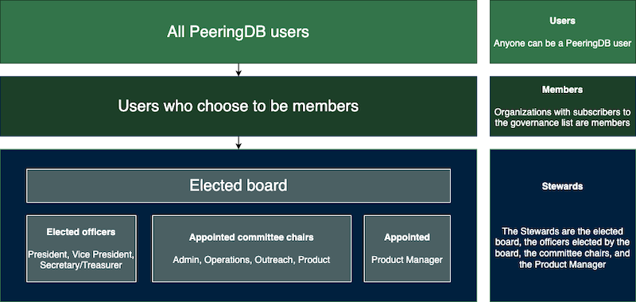

# HOWTO: Become a PeeringDB Member and Vote

PeeringDB is a membership organization. We do not charge for membership. You become a member when you have data in PeeringDB and subscribe to our governance mailing list. When you are a member, you may attend Members’ Meetings and vote in elections.

## How is PeeringDB governed?

PeeringDB members elect our board. The board elects officers (President, Vice President, Secretary/Treasurer) and appoints committees. The board, the officers, the chairs of the committees, and the Product Manager are the PeeringDB Stewards.

Non-board Stewards are responsible for keeping the board informed. The board and officers hold fiduciary responsibility for PeeringDB as a legal entity.

## How do I become a member?

Make sure you have data in PeeringDB (see other [HOWTOs](https://docs.peeringdb.com/howtos/)). Join the [pdb-gov mailing list](https://lists.peeringdb.com/cgi-bin/mailman/listinfo/pdb-gov). You are now a member.

## How can I vote?

Each member is entitled to one vote. Members who are affiliated with each other share a single vote. For instance, if Big Company owns Small Company they may only have one vote between them, not one vote each.

At the start of the election process, the Secretary/Treasurer will ask each member to nominate a single authorized voter. The Secretary will send each authorized voter an invitation to vote.

## Can I join a committee?

Yes! Volunteers run our committees. They are:

- [Admin](https://docs.peeringdb.com/committee/admin/) – provides support to our users
- Operations – keeps PeeringDB services running smoothly
- [Outreach](https://docs.peeringdb.com/committee/outreach/) – keeps the interconnection community aware of PeeringDB activity
- [Product](https://docs.peeringdb.com/committee/product/) – reviews and refines PeeringDB’s product design

If you want to join a committee, send a message to [stewards@peeringdb.com](mailto:stewards@peeringdb.com). 

## Where can I learn more?

We publish detailed governance documentation and records on our [governance website](https://docs.peeringdb.com/gov/). ]

## Improving this HOWTO

Please let us know how we could improve this article. Send a mail to the [Outreach Committee](mailto:outreachcom@lists.peeringdb.com).
