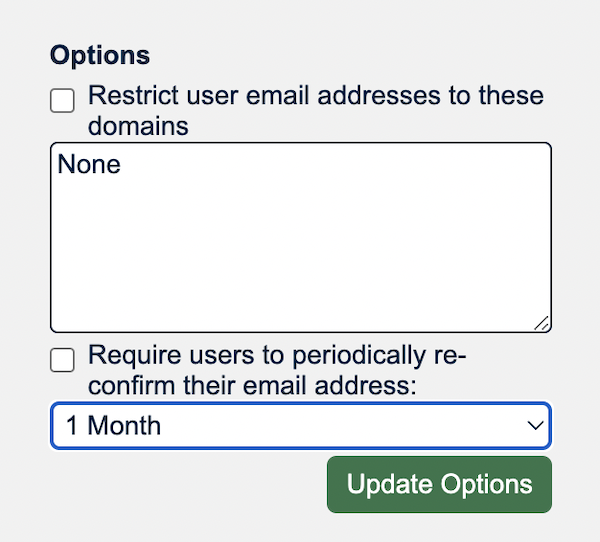
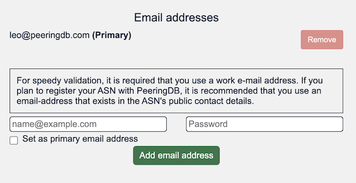

# HOWTO: Manage Organizational Policy

Your organization can apply policies for its users in the Manage section of the organization profile. 

## Restrict email domains

You can set a policy that only allows users to affiliate when their email address uses a specific domain. You can set a list of the domains your organization allows. 

If users do not meet the policy when it is configured they will not lose their affiliation. You will be notified so you can manage the change with your users.

A user with multiple email addresses associated with their account only needs one address to match. For instance, if the policy requires users to have an example.com address and the user has both an example.com and an example.net address, the user can affiliate.

## Periodic validation of user’s contact information

You can require users to validate the contact information for their PeeringDB user account. You set the time after which the validation process will be run. The default is 1 year but you can set it as short as 1 week.

This options is managed in the same control panel shown in the image above.

When an unvalidated user tries to login a link will be sent to their email address. They will need to go to that web page to validate their contact information before they can login.

Some users are affiliated with multiple organizations. When this is the case, the link will be sent to the most suitable address for that organization.

When a user is affiliated with multiple organizations, those organizations can set different revalidation periods. The user’s affiliation is suspended at the end of the validation counter only for that organization.

For example, Alice is affiliated to Example Networks and Example Facilities. Example Networks requires users to validate after 90 days but Example Facilities requires users to revalidate after a year. If Alice validates to both organizations on 1 January, she will remain a valid user for Example Facilities until the end of the year but will need to validate for Example Networks on 1 April.

## Multiple email addresses per user

Users may have multiple email addresses associated with their account. They must select one address as the primary address and this will be used for notifications. This is managed in each user's own profile, which is located in the hamburger menu by the user's username.

Each email address can only be associated with one user.

When a user with multiple email addresses associated with their account wants to remove the primary address, they will have to select another address as the primary address.

