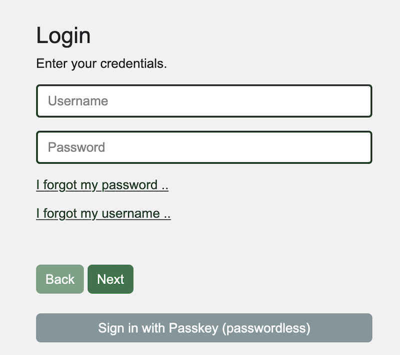
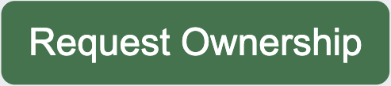
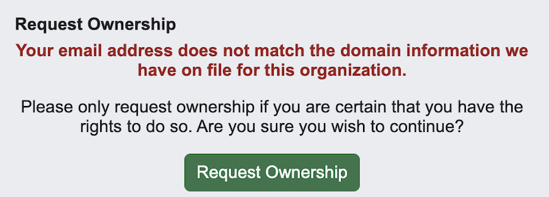

# HOWTO: Reclaim Ownership of a Network

## About PeeringDB
PeeringDB, as the name suggests, was set up to facilitate peering between networks and peering coordinators. In recent years, the vision of PeeringDB has developed to keep up with the speed and diverse manner in which the Internet is growing. The database is no longer just for peering and peering related information. It now includes all types of interconnection data for networks, clouds, services, and enterprise, as well as interconnection facilities that are developing at the edge of the Internet.

We believe in, and rely on the community to grow and improve the PeeringDB database. The volunteers who run the database are passionate about security, privacy, integrity, and validation of the data in the database. Even though PeeringDB is a freely available and public tool, users strictly adhere to the acceptable use policy, which prevents the database from being used for commercial purposes and discourages unsolicited communications. This is largely policed by the community and has been very effective since PeeringDB was launched.

## Why should I reclaim my network in PeeringDB?
Almost half of Autonomous System Numbers (ASNs) register their interconnection data in the PeeringDB database. That means, by using PeeringDB and adding your own interconnection data, you’ll be able to confidently find information about networks looking to interconnect, where and how to connect with them, and they’ll be able to find the same information about your network. Since the database is user-maintained and validated by our volunteers, you can trust that the information is accurate and up-to-date.

## You will need
We rely on the RIR or NIR records to show who a network is assigned to. So to ensure your request is approved via automation, if your org is the parent of a network object, the primary, verified email address of your PeeringDB user account should be visible in the RDAP data of your ASN.  You should either update your RDAP data to include your email address, or verify an email address that is visible within the RDAP data, on your PeeringDB user account. 

## Request ownership
To request ownership of a network you need to login to your PeeringDB account. To do this, you need to have:

 - Your username
 - Your password
 - Your second factor

Your username is not the same as your e-mail address. If you’ve forgotten your username, click on the link for forgotten usernames, enter your e-mail address and you’ll be sent a reminder.

If you’ve forgotten your password, click on the link for forgotten passwords, enter your address and you’ll be sent a re-set link.

If you’ve forgotten your second factor you’ll need to contact [support@peeringdb.com](mailto:support@peeringdb.com) to get help re-setting that.

Once you’ve logged in, go to the page for your network. Look in the top right, below the hamburger menu. You’ll see a green button that says: Request Ownership. Click it.

If your address matches, you’ll be given ownership of the network. If it doesn’t match what we have on record you’ll be warned but can still request ownership. Your request will be reviewed by our volunteer administrators.

## Need more help?
If this process doesn’t work for you, please contact [support@peeringdb.com](mailto:support@peeringdb.com), so one of our volunteers can help.

## Improving this HOWTO
Please let us know how we could improve this article. Send a mail to the [Outreach Committee](mailto:outreachcom@lists.peeringdb.com).