# HOWTO: Get Started with Search in PeeringDB

## Introduction to PeeringDB

PeeringDB is a publicly available network database that is the go-to location for interconnection data. The database facilitates global network connections at Internet Exchange Points (IXPs), data centers, and other interconnection facilities, and it serves as a starting point for interconnection decisions.

This online database is a non-profit, community-driven effort that encourages the exchange of Peering-related information and is totally managed and maintained by volunteers. It's a tool for the Internet's growth and enhancement.

## Why use PeeringDB to search for networks, exchange and data centers?

About a third of networks (Autonomous Systems) use PeeringDB to share information about how they interconnect. You can use PeeringDB to find information about other networks, exchanges, and more. You make your services easier to find when you contribute your data to PeeringDB. 

You don't need an account to use the basic search functionality. But if you want to access private contact information and use advanced search features, like radius search, you'll need to sign up for an account.

## How to search for campuses, carriers, exchanges, facilities and networks in PeeringDB

There is a s simple search box on the [front page](https://www.peeringdb.com/) of PeeringDB. You can use it to search for campuses, carriers, exchanges, facilities and networks listed in PeeringDB by simply entering the name you want. Let’s demonstrate with some examples to see how this works.

### Place name normalization

PeeringDB normalizes place names at the presentation layer. For example, München will always be normalized to Munich in search output. This ensures that users can get all the results for Munich in a single search. Users can search using multiple names. As long as the name selected is well known, the search will be centered on the correct place.

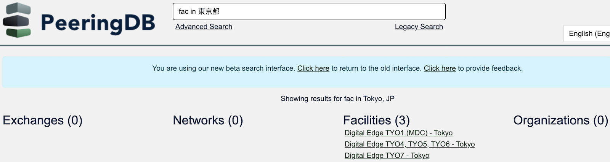

### Networks

For this example, we have this network **KENET** which is a non-profit operator for education and research and we want to search for it on PeeringDB.  There are two ways to search for networks in PeeringDB:

#### Name search

You can search for networks by using the name of the networks by:
- Entering the name of the network as seen below
- From the search result, under the Networks section, locate the network you have searched
- It would be visible if it is in the PeeringDB database

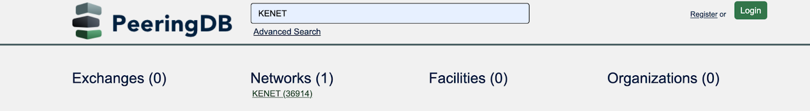

#### ASN search

You can search for networks using their ASN by:
- Entering the name of the network as seen below, for the example below the ASN is (36914)
- From the search result, under the Networks section, locate the network you have searched

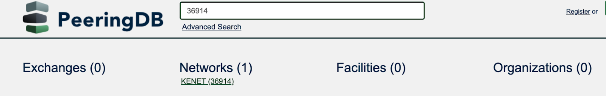

**Note**: Either of the two methods will get the same search results. 

### Exchanges

For this example, let’s consider this exchange **UNY-IX** which is an open Internet exchange located in Universitas Negeri Yogyakarta.
 To search for an exchange:
- Enter the name of the exchange as shown below
- From the search result, under the exchanges section, locate the exchange you have searched

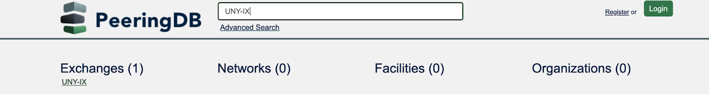

### Facilities

Data centers are also referred to as facilities. For this example, let’s consider this university **University of Oslo** which is an institution in Oslo.
To search for a facility:
- Enter the name of the data center or facility as shown below
- From the search result, under the facilities section, locate the facility or data center you have searched

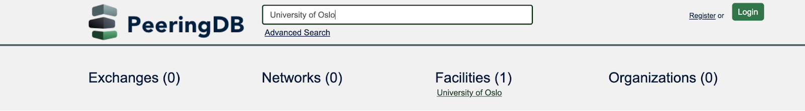

You can also search on a map, using our [.KMZ download](https://www.peeringdb.com/export/kmz/). You can either download it and load it into a GIS application or add it as a network location. Whichever you choose, you then search the map for names or by dragging it around. GIS applications often let you show PeeringDB data with other datasets, enabling a simple, visual, integrated analysis.

<iframe width="560" height="315" src="https://www.youtube.com/embed/6DicZPMXZ5E?si=8SLtGCgtAyFSFEmU" title="YouTube video player" frameborder="0" allow="accelerometer; autoplay; clipboard-write; encrypted-media; gyroscope; picture-in-picture; web-share" referrerpolicy="strict-origin-when-cross-origin" allowfullscreen></iframe>

## How to search for your own organization
If your organization already uses PeeringDB, when you are logged in to the website you can always find your own information using the `self` search. If you are not logged in, these links will take you to some PeeringDB examples objects.

- [Organization](https://www.peeringdb.com/org/self)
- [Campus](https://www.peeringdb.com/campus/self)
- [Carrier](https://www.peeringdb.com/carrier/self)
- [Facility](https://www.peeringdb.com/fac/self)
- [Internet Exchange Point](https://www.peeringdb.com/ix/self)
- [Network](https://www.peeringdb.com/net/self)

The `self` identifier also works for queries made using our API. We encourage the use of [multi-factor authentication](https://docs.peeringdb.com/howto/authenticate/). This means using an API Key instead of basic authentication for API queries.

## How to use the search in PeeringDB extension

The PeeringDB search extension is a free to use Google Chrome extension with which you can use to search for ASNs, networks, and exchanges in PeeringDB.

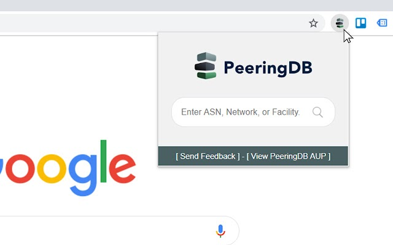

To get started, go to the [Chrome Web Store](https://chrome.google.com/webstore/detail/search-in-peeringdb/aogffgldgfjelpadabfbcngmndbceiad/related?hl=en) and download the extension, then enable it and add it to your extension bar. There are two ways to use the extension once it has been enabled:

- **Using the Extension Bar Icon**: Click the icon and type your search term into the box. The search will open in a new tab with the search result.

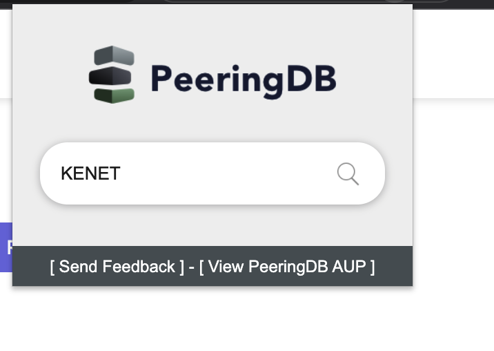

Below is the result:

- **Using the Context Menu**: Right-click on any text on a page and select "Search in PeeringDB". The search will open in a new tab with the search result.

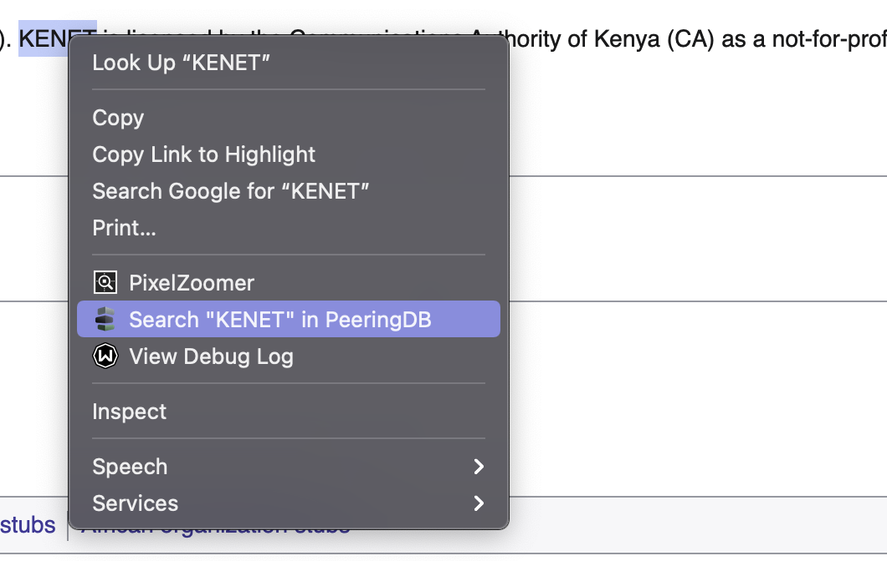

Below is the result:

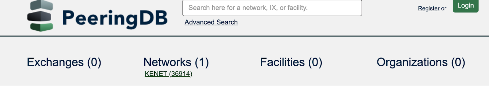

If the query or highlighted text contains a number, the extension will attempt to find an ASN. 

## How to search based on a partial name

You can search based on a partial name. When an organization, network, facility or exchange name has two parts, you can search for just the first or second part and then select from all the organizations that share that name. This makes it easier to find the organization you want. This can also be helpful in a situation where you can not remember the name of the organization in full. 

In the example below, we want to search for “internet archive”. We will search for it with a single part and not with the full name. In the search box, input “archive''. This brings out a search result that have similar parts in their names. 

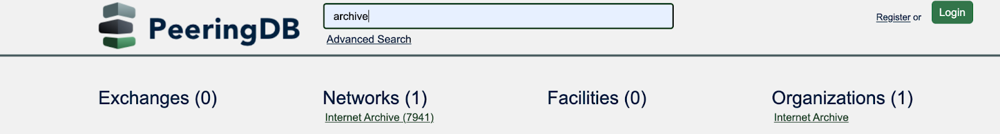

You can now search through the results to find the what you want.

## What is an advanced search?

Advanced search in PeeringDB lets you explicitly filter a search location, network presence, service level and a wide range of other features. You get the results you’re looking for and can export them in structured data formats (JSON or CSV), so you can import the data into tools that will help you make decisions. 

**Note**: You need to be logged in to PeeringDB in order to use some of the advanced search features, including the radius search.

Let’s take a look at this example below to demonstrate how advanced search works. We are going to search for an exchange within a particular region.  On the front page of PeeringDB you will see the Advanced Search box which you can use to search for campuses, exchanges, facilities and networks that are in PeeringDB.

- Click on the Advanced Search link. This takes you to the advanced search landing page. The search page shows the campus, exchanges, facilities, networks, and organizations tabs. 

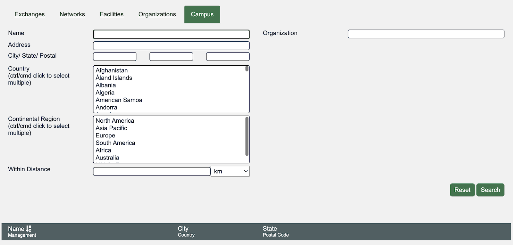

- Go to the Exchanges tab, in the country field select a country of your choice by scrolling through the different options.

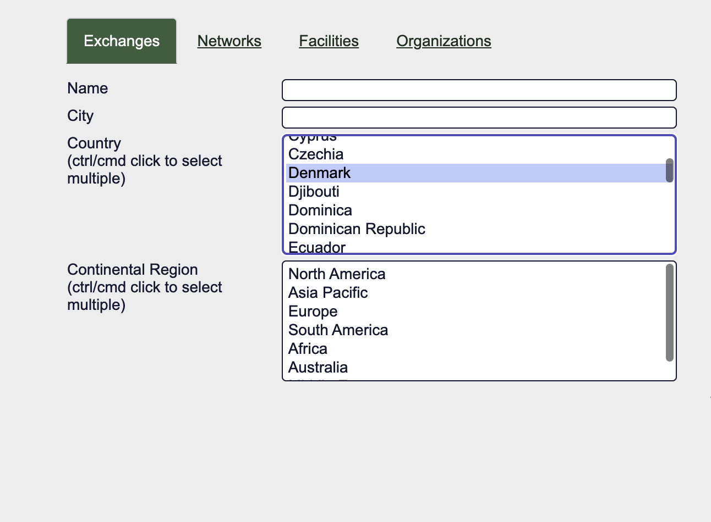

- On the right hand side, in the Network Presence field, enter the name of the network. You can follow the example shown below and add KENET.
- Click on the drop down list that appears as you input the network name.

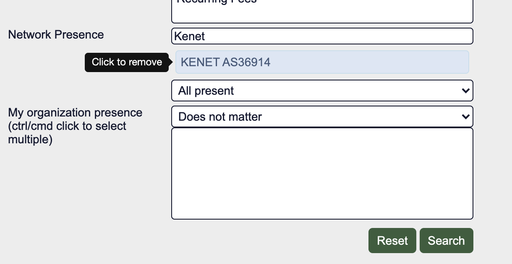

- Click on Search.
- Scroll down to view information regarding the exchange that you searched for.
- Click on JSON or CSV to download the information in a structured format.

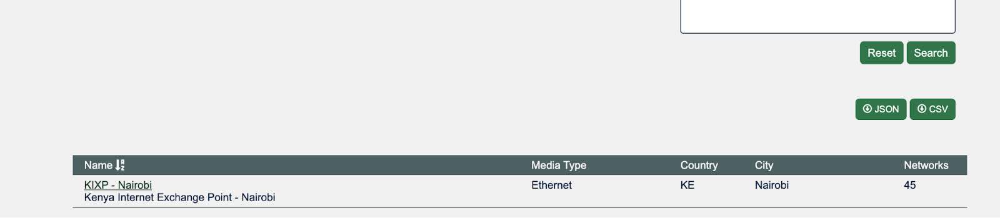

## Geographic search

As new facilities are created in our database they will be linked to geographic coordinates. PeeringDB has improved search by changing the way it records data for location in its database. You can now search for facilities with a distance radius of a chosen coordinate. 

### How to search for a campus

You can search for a campus of facilities using the Advanced Search interface. Users can search from a country and city, and select a radius in kilometers or miles. Of course, you can achieve the same results using the API or the web interface, which means you can integrate this feature into your own tools.

**Note**: You need to be logged in to PeeringDB in order to search for a campus of facilities.

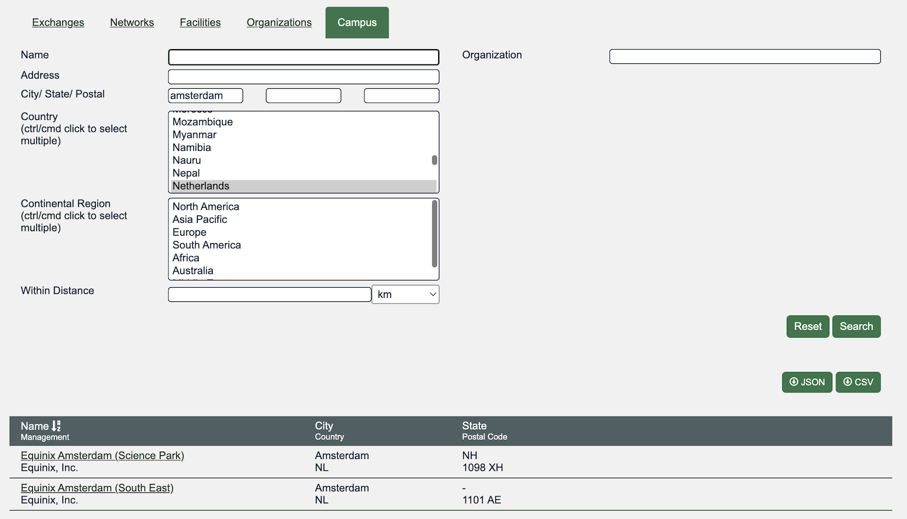

### How to search for facilities within a given radius

You can search for facilities within a given radius, using the Advanced Search interface. Users can search from a country and city, and select a radius in kilometers or miles. Of course, you can achieve the same results using the API or the web interface, which means you can integrate this feature into your own tools.

**Note**: You need to be logged in to PeeringDB in order to search for facilities within a given radius.

- Login in or register an account on PeeringDB.
- On the front page of PeeringDB, click on the Advanced Search link.
- Go to the Facilities Tab and in the city/postal field add a city or postal of your choice.
- In the country field select a country of your choice.
- In the Within Distance field  add a specified distance of your choice.
- On the right hand side of the page, click on search.
- Scroll down to view the information you searched for. The search result will bring up facilities which are in that country, city and state.
- You can download your information in a JSON or CSV format.

<iframe width="560" height="315" src="https://www.youtube-nocookie.com/embed/FzOUKhJjRRg" title="YouTube video player" frameborder="0" allow="accelerometer; autoplay; clipboard-write; encrypted-media; gyroscope; picture-in-picture" allowfullscreen></iframe>

## Get an API query from a web query

You can put the API query for simple and advanced searches directly into your copy buffer. Just click on the "Copy Query" button. It will present you with a screen that lets you choose that query formatted for `curl`, and a selection of programming languages.

You need to replace the placeholder with your own [API Key](/howto/api_keys/) for advanced queries. You can remove the authorization section anonymous simple queries. Note that anonymous users get a [lower query limit](/howto/work_within_peeringdbs_query_limits/).

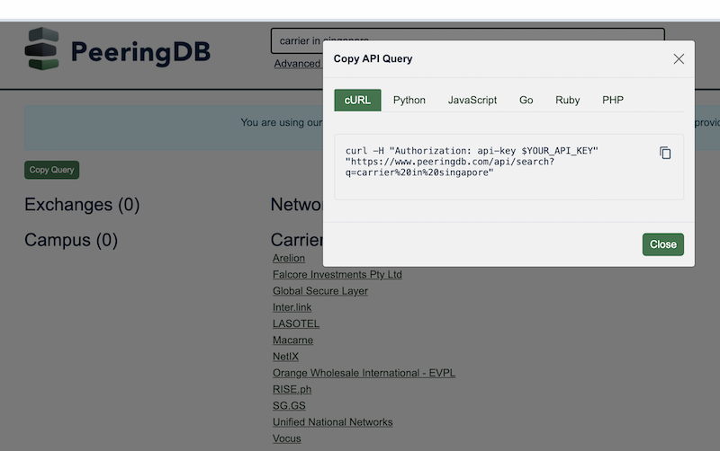

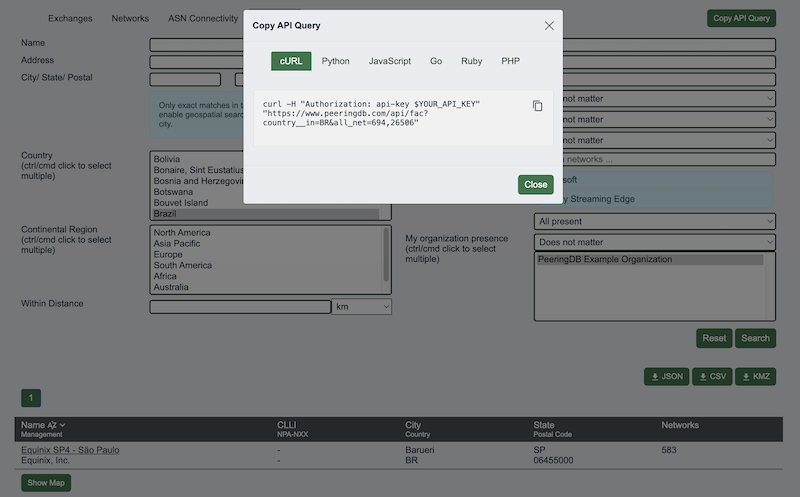

For the full API reference — object types, authentication, and command-line examples using curl, Python, and jq — see [Query the PeeringDB API](query_the_api.md).

## Improving this HOWTO

Please let us know how we could improve this article. Send a mail to the [Outreach Committee](mailto:outreachcom@lists.peeringdb.com).