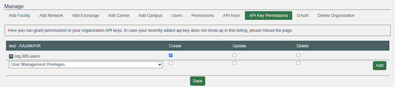
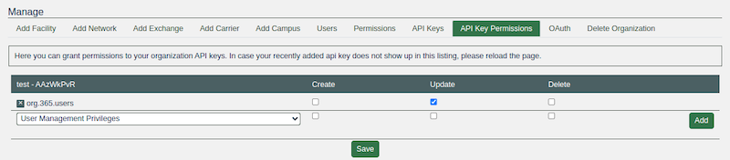
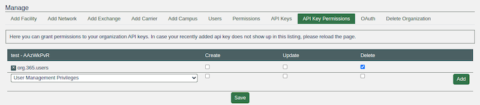

# HOWTO: Manage Users With Our API

## Introduction
This document outlines how to use the Organization Users API for managing users within an organization. The API provides endpoints for listing, adding, updating roles, and removing users.

## Authentication 
All API requests require authentication using API keys. There are two types of authentication:

1. **User API Key:** The user must be an admin of the organization
2. **Organization API Key:** The key must have specific permissions for the operation

Include the API key in the HTTP header:
```
`Authorization: api-key YOUR_API_KEY`
```

## Rate limits 

All endpoints are rate-limited to 1 request per second. 

## Endpoints 
### List organization users

Retrieves all users associated with an organization.

**URL:**  `/api/org/{org_id}/users/`

**Method:**  `GET`

**Required permission:** There are two options

1. `admin organization`
2. `read` on `org.{id}.users` namespace (basically just add `User Management Privileges` permission in Organization API Key Permission editor)


**Example request:**

```
curl -X GET \
 -H "Authorization: api-key a3bXQSbD.D5WtkaSzsryacujQCMeY2hSzcDO1d3oP" \
 https://peeringdb.com/api/org/365/users/
```

**Successful response** (200 OK):
```
{
  "data": [
    {
      "id": 16,
      "first_name": "John",
      "last_name": "Doe",
      "full_name": "John Doe",
      "is_active": true,
      "date_joined": "2024-10-23T08:37:39Z",
      "status": "ok",
      "role": "admin"
    },
    {
      "id": 21,
      "first_name": "Jane",
      "last_name": "Smith",
      "full_name": "Jane Smith",
      "is_active": true,
      "date_joined": "2024-10-23T09:13:50Z",
      "status": "ok",
      "role": "member"
    }
  ],
  "meta": {}
}
```

### Add user to organization

Adds a user to the organization with a specified role.

**URL:** `/api/org/{org_id}/users/add/`

**Method:** `POST`

**Required permission:** There are two options

1. `admin organization`
2. `create` on `org.{id}.users namespace`



**Request body:**

* `user_email` (required): Email address of the user to add
* `role` (optional): Role to assign (`admin` or `member`, defaults to `member`)

**Example request:**
```
curl -X POST \
 -H "Authorization: api-key AAzWkPvR.waJqOendMCyS0eOdFGXHGhiYjtee6h6X" \
 -H "Content-Type: application/json" \
 -d '{"user_email": "user@email.com", "role": "admin"}' \
 http://peeringdb.com/api/org/365/users/add
```

**Successful response** (201 Created):
```
{
 "data": [
   {
     "id": 22,
     "first_name": "User",
     "last_name": "user",
     "full_name": "User user",
     "is_active": true,
     "date_joined": "2024-10-23T08:37:39Z",
     "status": "ok",
     "role": "admin"
   }
 ],
 "meta": {}
}
```

**Error responses**:

* **400 Bad Request**: Missing or invalid parameters
* **403 Forbidden**: Insufficient permissions
* **404 Not Found**: User not found

### Update user role

Updates a user's role within the organization.

**URL:** `/api/org/{org_id}/users/{user_id}/`

**Method:** `PUT`

**Required permission:** There are two options

1. `admin organization`
2. `update` on `org.{id}.users` namespace



**Request body:**

* `role` (required): New role to assign (`admin` or `member`)

**Example request:**

```
curl -X PUT \
 -H "Authorization: api-key AAzWkPvR.waJqOendMCyS0eOdFGXHGhiYjtee6h6X" \
 -H "Content-Type: application/json" \
 -d '{"role": "admin" }' \
 http://peeringdb.com/api/org/365/users/21
```

**Successful response** (200 OK):

```
{
 "data": [
   {
     "id": 21,
     "first_name": "",
     "last_name": "",
     "full_name": "",
     "is_active": true,
     "date_joined": "2024-10-23T09:13:50Z",
     "status": "ok",
     "role": "admin"
   }
 ],
 "meta": {}
}
```

**Error responses:**

* **400 Bad Request**: Missing or invalid parameters
* **403 Forbidden**: Insufficient permissions
* **404 Not Found**: User not in organization

### Remove user from organization

Removes a user from the organization.

**URL:** `/api/org/{org_id}/users/remove/`

**Method:** `DELETE`

**Required permission:** `delete` on `org.{id}.users` namespace



**Request body:**

* `user_email` (required): Email address of the user to remove

**Example request:**

```
curl -X DELETE \
 -H "Authorization: api-key AAzWkPvR.waJqOendMCyS0eOdFGXHGhiYjtee6h6X" \
 -H "Content-Type: application/json" \
 -d '{"user_email": "user@email.com" }' \
 http://localhost:8000/api/org/365/users/remove
```

**Successful response** (204 No Content)

**Error responses:**

* **400 Bad Request**: Missing or invalid parameters
* **403 Forbidden**: Insufficient permissions
* **404 Not Found**: User not in organization

## Error handling

The API returns appropriate HTTP status codes and error messages:

* **400 Bad Request**: Invalid input parameters
* **403 Forbidden**: Authentication failed or insufficient permissions
* **404 Not Found**: Requested resource not found
* **429 Too Many Requests**: Rate limit exceeded

Error responses include a detail message explaining the issue:

```
{
 "meta": {
   "error": "Permission denied: User is not an admin of this organization"
 }
}
```

## Permissions

The API uses a permission system to control access:

1. For user API keys, the user must be an admin of the organization
2. For organization API keys, the key must have specific permissions, editable through Organization API Key Permission editor UI:
- `User Management Privileges Permission`: List users
- `Check Create Option`: Add users
- `Check Update Option`: Update user roles
- `Check Delete Option`: Remove users
