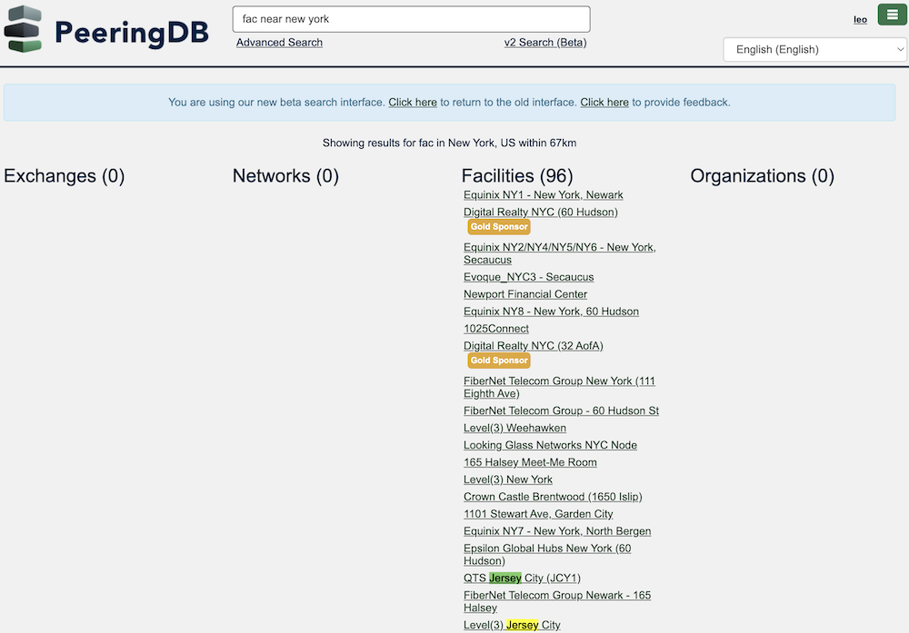
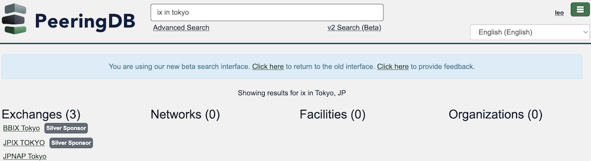
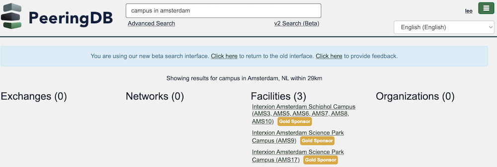
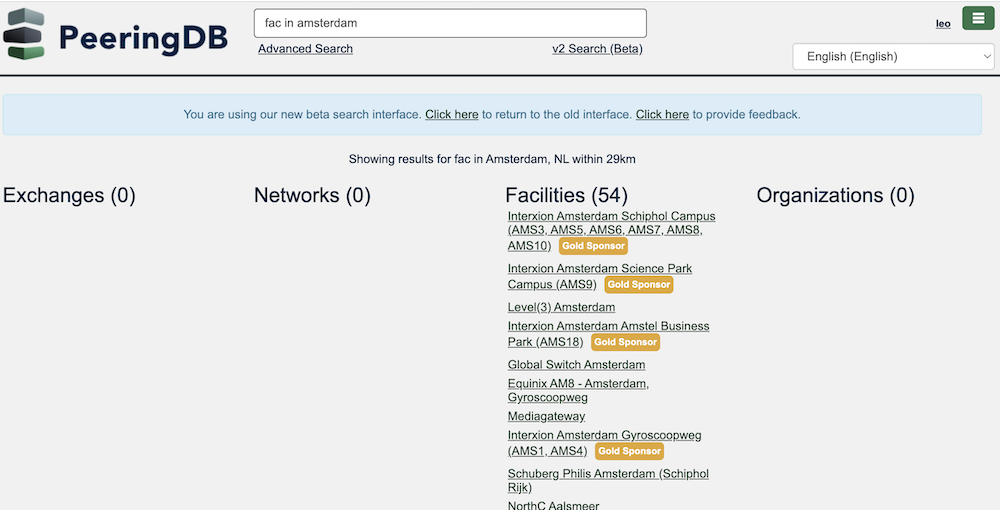

# HOWTO: v2 Search

We are testing v2 search in parallel with our production v1 search tools. We encourage you to test it and [give us feedback](https://forms.gle/TYJgvrCGvyTCiaCY8). Is it faster? Does  it simplify the search process? Does it give you the results you expect? Your input helps us deliver the tools you want.

When you click one the [link for v2 search](https://www.peeringdb.com/search/v2?q=), you just type your query in the box and hit enter, like normal.

## Concept

v2 lets you use some natural language queries in combination with the name for an area. It helps you get the results in fewer searches, ideally just one!

## Search for a network

Searches for numbers can be interpreted as a search for a location as well as a network. When searching for a network prefixed with 'AS', partial matches show all relevant networks while direct matches take you straight to the network's page.

*Fig 1: A search for* `as333` *shows results for AS3330 and AS33309*

## Support for metro sizes

For many areas it will automatically set an appropriate radius. When a common business area crosses a jurisdictional boundary, the search is based on the common business area and not limited to the named metro area.

*Fig 2: A search for* `fac near new york` *includes results for facilities in Jersey City, NJ*

When you want a different radius, our [Advanced Search](https://www.peeringdb.com/advanced_search) tool lets you manually set a specific radius based on any street address. 

## Searching directly for IXs

v2 search finds exchanges based on the facilities they are in. You don’t need to search for facilities in a metro area and then find the exchanges they host. You can do it in a single search.

*Fig 3: A search for* `ix in tokyo` *finds exchanges at facilities we know about in Tokyo*

## Support for campus

v2 search knows about campus objects – interconnected facilities under common ownership – so you can find campuses for an area as well a getting a full list of facilities.

*Fig 4: Searching for a* `campus in amsterdam` *shows just three entries*

*Fig 5: Searching for a* `fac in amsterdam` *shows many more results*

## Improving this HOWTO

Please let us know how we could improve this article. Send a mail to the [Outreach Committee](mailto:outreachcom@lists.peeringdb.com).