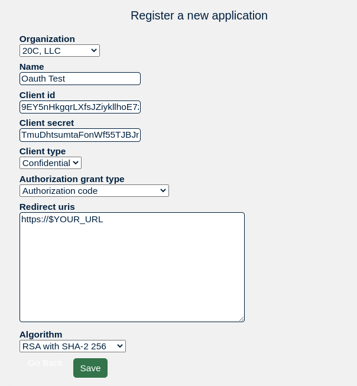

## OAuth

PeeringDB now offers OAuth2 authentication for third-party applications to allow users to authenticate against PeeringDB.

Implementation details are at [Github #131](https://github.com/peeringdb/peeringdb/issues/131).  For an example, see [IXP-Manager issue #322](https://github.com/inex/IXP-Manager/issues/322).  

### What is OAuth?

There is a good write up at <https://aaronparecki.com/oauth-2-simplified/>.

### Register an application

First you need to [register](https://www.peeringdb.com/oauth2/applications/) your application at PeeringDB.

:

For most applications, you'll want to use the following:

1. Client type: Confidential
2. Authorization grant type: Authorization code
3. Redirect uris: *add your redirect URLs here*
4. An OIDC algorithm must be selected.

### URLs

```python
PDB_ENDPOINT = "https://auth.peeringdb.com/"

PDB_OAUTH_ACCESS_TOKEN_URL = '{}oauth2/token/'.format(PDB_ENDPOINT)
PDB_OAUTH_AUTHORIZE_URL = '{}oauth2/authorize/'.format(PDB_ENDPOINT)
PDB_OAUTH_PROFILE_URL = '{}profile/v1'.format(PDB_ENDPOINT)
```

### Fields

The fields are based largely on OpenID Connect.

Scopes currently are defined as 

- `profile` : user profile
- `email` : adds fields `email` and `verified_email`
- `networks` : add field `networks`

The `perms` field is a bitmask for [CRUD](https://en.wikipedia.org/wiki/Create,_read,_update_and_delete) as the 4 least significant bits. See following:

```
0b0000 1 1 1 1
       | | | +-- Delete
       | | +---- Update
       | +------ Read
       + ------- Create
```

Example for my user:

```json
{
  "id": 3,
  "name": "Matt Griswold",
  "given_name": "Matt",
  "family_name": "Griswold",
  "email": "grizz@20c.com",
  "verified_user": true,
  "verified_email": true,
  "networks": [
    {
      "perms": 15,
      "asn": 63311,
      "name": "20C",
      "id": 20
    }, 
    {
      "perms": 15,
      "asn": 33713,
      "name": "United IX",
      "id": 7889
    }
  ]
}
```

### Backend configuration

We have an [example backend configuration](https://github.com/peeringdb/peeringdb/blob/master/docs/dev/oauth.md) for Python Social Core. It describes the [RFC 8176](https://datatracker.ietf.org/doc/html/rfc8176) Authentication Method Reference Values we collect.
